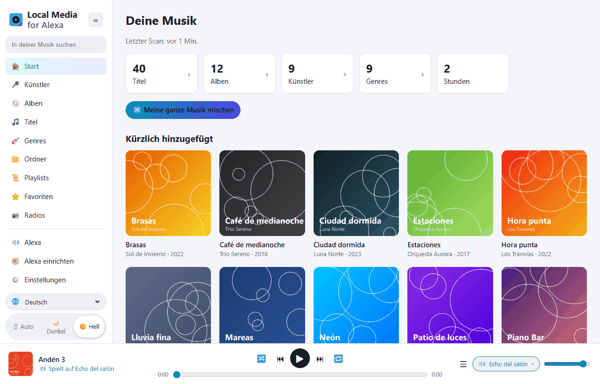
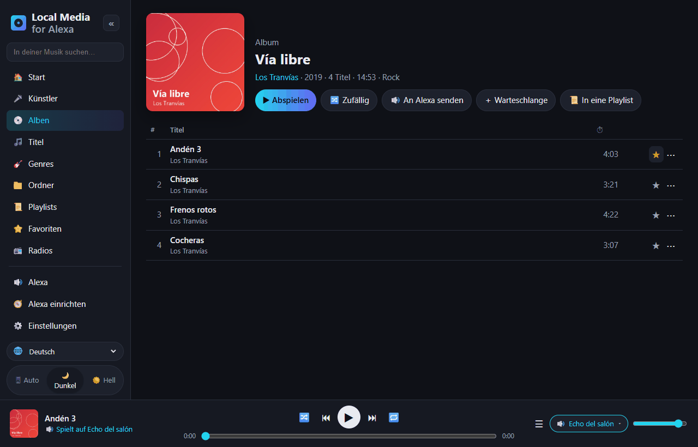
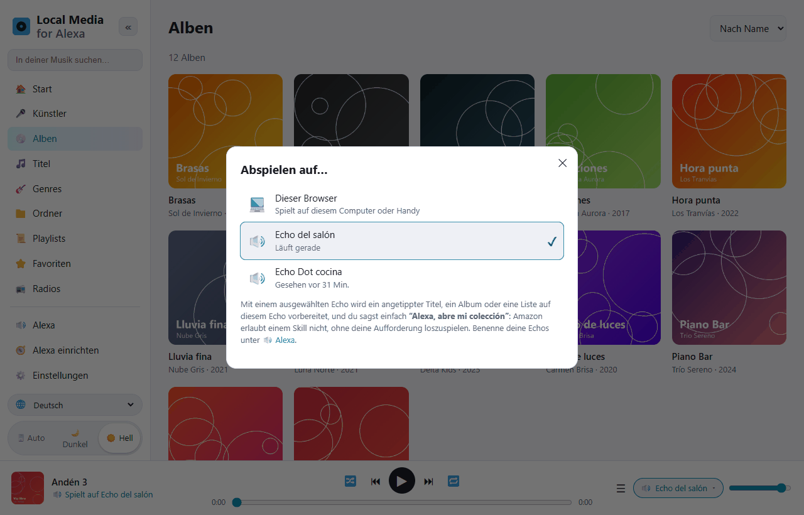
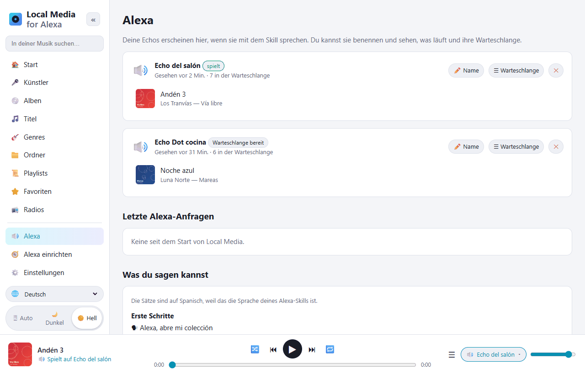
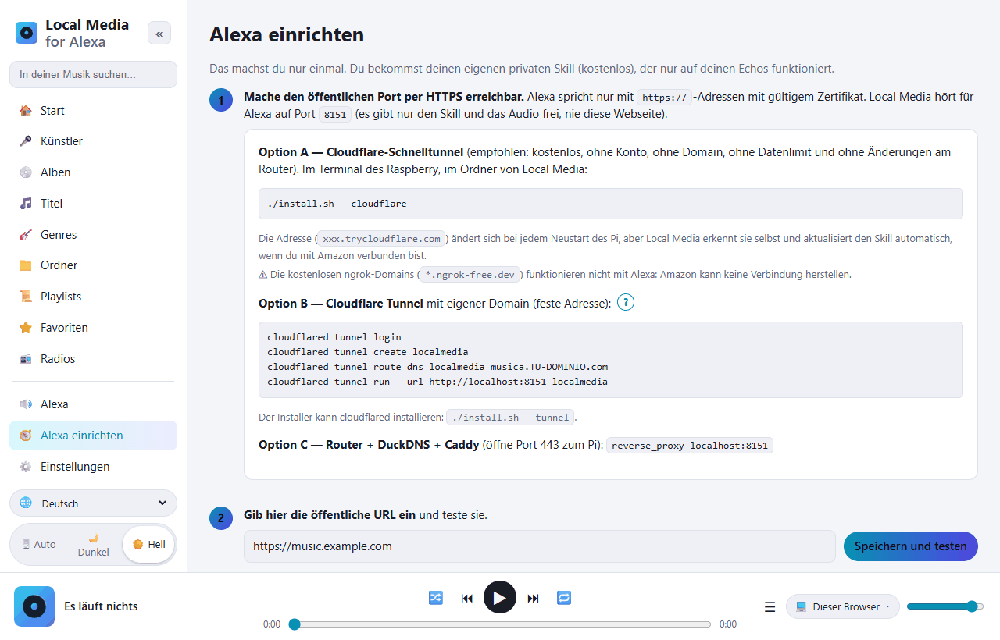

# Local Media for Alexa — die Musik deines Raspberry Pi auf Alexa

[Español](README.md) · [English](README.en.md) · [Português](README.pt.md) · [Français](README.fr.md) · **Deutsch** · [Italiano](README.it.md) · [Polski](README.pl.md) · [Русский](README.ru.md) · [한국어](README.ko.md) · [日本語](README.ja.md)

Freie, selbst gehostete Alternative zu *My Media for Alexa* für **Raspberry Pi / ARM-Linux**
(läuft auch auf jedem x86-Linux oder mit Docker).
Sie scannt deine Musik (USB-Laufwerk, SD-Karte, eingebundenes NAS oder DLNA-Server) und spielt sie
per Sprache auf deinen Echo-Geräten ab. Alles bleibt zu Hause: keine Zwischenserver, keine Fremdkonten.



Der Alexa-Skill funktioniert auf **Spanisch** (Spanien, Mexiko, USA) und **Englisch** (USA, Großbritannien).
Die Sätze werden in der Sprache des Skills gesprochen:

```
"Alexa, abre mi colección"
"Alexa, pide a mi colección que ponga Queen"
"Alexa, pide a mi colección que ponga el disco Abbey Road"
"Alexa, abre mi colección reproduzca la pista Bohemian Rhapsody"
"Alexa, siguiente" · "Alexa, aleatorio" · "Alexa, pide a mi colección qué está sonando"
```

Auf Englisch: *„Alexa, open my collection“*, *„Alexa, ask my collection to play Queen“*…

## Ein Blick auf die Weboberfläche

Die Verwaltungsoberfläche öffnest du vom Handy oder PC zu Hause aus (`http://IP-DES-PI:8080`).
Sie ist in 10 Sprachen übersetzt (🌐-Auswahl unten links) und hat ein helles und ein dunkles Design.

| | |
|---|---|
|  |  |
| **Durchsuche deine Bibliothek** nach Künstlern, Alben, Titeln, Genres, Ordnern, Playlists und Radios. Jeder Titel hat einen Favoriten-Stern ⭐ und ein ⋯-Menü (als Nächstes, in die Warteschlange, zu einer Playlist…). | **Abspielen auf…**: im Browser abspielen oder die Warteschlange auf dem gewählten Echo vorbereiten. Dann einfach *„Alexa, abre mi colección“* sagen. |
|  |  |
| **Alexa**: deine Echo-Geräte, was jedes gerade spielt und seine Warteschlange. Gib ihnen Namen. Darunter alle Sätze, die du sagen kannst. | **Alexa einrichten**: Schritt-für-Schritt-Anleitung. Mit der Schaltfläche *Mit Amazon verbinden* wird der Skill automatisch erstellt. |

## Installation auf dem Raspberry Pi

Voraussetzungen: Raspberry Pi 3/4/5 oder Zero 2 W mit Raspberry Pi OS (Bookworm oder neuer).

```bash
sudo apt update && sudo apt install -y git
git clone https://github.com/DivolandiaLabs/Local-Media-for-Alexa.git
cd Local-Media-for-Alexa
chmod +x install.sh
./install.sh --cloudflare
```

Optionen des Installers:

```bash
./install.sh --music /media/pi/USB/Musik    # gleich einen Musikordner hinzufügen
./install.sh --cloudflare                   # Cloudflare-Schnelltunnel: kostenloses HTTPS für Alexa (empfohlen)
./install.sh --tunnel                       # nur cloudflared installieren (Tunnel mit eigener Domain)
```

Öffne `http://IP-DES-PI:8080` am Handy oder PC:

1. **Einstellungen** → Ordner hinzufügen → **Jetzt scannen**.
2. **Alexa einrichten** → Schritt-für-Schritt-Anleitung (etwa 10 Minuten, nur einmal).

Auf die neueste Version aktualisieren:

```bash
cd ~/Local-Media-for-Alexa && git pull && ./install.sh
```

Danach in **Alexa einrichten** auf **🗣 Sprachmodell aktualisieren** drücken, damit der Skill die neuen Sätze bekommt.

Mit Docker: siehe die Anleitung am Anfang des [Dockerfile](Dockerfile).

### Älteres Raspberry Pi OS (Bullseye / Buster)

Prüfe deine Version mit `cat /etc/os-release`. Raspberry Pi OS **Bullseye** (Debian 11) und
**Buster** (Debian 10) werden nicht mehr unterstützt, und Debian entfernt ihre Pakete von den
normalen Servern: `apt` meldet `404 Not Found`. Local Media läuft darauf
(es braucht nur Python 3.7+), aber `apt` muss `python3-venv` und `ffmpeg` installieren können.

**Empfohlen:** eine neue Karte mit dem aktuellen Raspberry Pi OS (64 Bit) beschreiben,
mit dem [Raspberry Pi Imager](https://www.raspberrypi.com/software/). Nur dieses
bekommt weiterhin Sicherheitsupdates.

**Schnelle Lösung (bei Bullseye bleiben):** Wenn `sudo apt update` sich über die
Debian-Paketquellen beschwert, leite sie auf das Archiv um und versuche es erneut:

```bash
sudo cp /etc/apt/sources.list /etc/apt/sources.list.bak
echo "deb http://archive.debian.org/debian bullseye main contrib non-free" | sudo tee /etc/apt/sources.list
echo "deb http://archive.debian.org/debian-security bullseye-security main contrib non-free" | sudo tee -a /etc/apt/sources.list
sudo apt update
cd ~/Local-Media-for-Alexa && ./install.sh
```

(Rückgängig machen: `sudo cp /etc/apt/sources.list.bak /etc/apt/sources.list`.)

## Funktionen

| My Media for Alexa | Local Media |
|---|---|
| Abspielen nach Künstler, Album, Titel, Genre, Playlist | ✅ mit unscharfer Suche (verträgt, was Alexa falsch versteht) |
| Abspielen nach Ordner | ✅ |
| Nach Jahr / Jahrzehnt | ✅ „Musik von 1995“, „aus den Neunzigern“ |
| Gesamte Bibliothek zufällig | ✅ |
| Neu hinzugefügt / meistgehört / Favoriten | ✅ |
| „Mehr von diesem Künstler“, „spiel dieses Album“ | ✅ |
| Weiter, zurück, Pause, fortsetzen, von vorn | ✅ |
| Zufallswiedergabe und Wiederholen | ✅ |
| Tasten am Echo und Steuerung in der Alexa-App | ✅ |
| „Was läuft gerade?“ | ✅ |
| Cover und Titel auf Echo Show / Spot / App | ✅ (cover.jpg im Ordner oder eingebettetes Cover) |
| M3U- / M3U8- / PLS-Playlists | ✅ werden beim Scannen automatisch importiert |
| iTunes-Playlists | ✅ liest eine exportierte `iTunes Library.xml` / `Library.xml` (Ablage › Mediathek › Exportieren) |
| Album, Künstler, Playlist oder Genre zufällig abspielen | ✅ |
| Modi in eigenen Worten („Loop-Modus an“, „Shuffle aus“…) | ✅ |
| „Füge das zu meiner Playlist X hinzu“ | ✅ (legt sie bei Bedarf an) |
| „Spiel das nicht mehr“ / „vergiss diesen Titel“ | ✅ Liste der ignorierten Titel, in den Einstellungen wiederherstellbar |
| Internetradio / Streams („spiel den Sender X“) | ✅ Bereich 📻 Radios in der Weboberfläche und .m3u/.pls-Dateien mit http-Adressen |
| Hörbücher („lies X“) | ✅ merkt sich, wo du warst |
| My-Media-Satzform: „Alexa, abre mi colección reproduzca …“ | ✅ |
| Eigene Playlists | ✅ in der Weboberfläche angelegt und bearbeitet, als M3U exportierbar |
| FLAC, WMA, OGG, OPUS, WAV, ALAC, APE… | ✅ Echtzeit-Umwandlung in MP3 mit ffmpeg (mit Spulen/Fortsetzen) |
| UPnP- / DLNA-Server (NAS, Plex, Jellyfin, MiniDLNA…) | ✅ |
| Mehrere Echo-Geräte, jedes mit eigener Warteschlange | ✅ |
| Alexa-Multiroom-Gruppen | ✅ (verwaltet Alexa) |
| Weboberfläche zum Durchsuchen der Bibliothek | ✅ + Player im Browser, dunkler Modus, 10 Sprachen |
| Warteschlange im Web vorbereiten und an einen Echo senden | ✅ Auswahl „Abspielen auf…“ |
| Automatisches Neuscannen | ✅ inkrementell, alle N Minuten |
| Fernzugriff | ✅ Cloudflare Tunnel / Caddy (ohne Zwischenserver von Dritten) |
| Sprachen des Skills (Stimme) | ✅ es-ES, es-MX, es-US, en-US, en-GB |

## Wie alles zusammenpasst

```
Echo ──Stimme──▶ Amazon ──HTTPS──▶ Tunnel (Cloudflare) ──▶ Pi :8765  /alexa   (Skill)
Echo ◀────────────────── Audio über HTTPS ─────────────── Pi :8765  /s/<geheim>/…
Du (Handy/PC, zu Hause) ─────────────────────────────────▶ Pi :8080  Verwaltungsoberfläche
```

* **Port 8765** ist der einzige, der ins Internet geht: Er antwortet nur Alexa (mit geprüfter
  Amazon-Signatur) und liefert Audio und Cover hinter einem zufälligen geheimen Schlüssel.
* **Port 8080** (die Weboberfläche) bleibt in deinem Heimnetz. Du kannst ein Passwort setzen.
* Alexa verlangt HTTPS mit gültigem Zertifikat, deshalb braucht es einen Tunnel oder Proxy.
  Am einfachsten ist der Cloudflare-Schnelltunnel (`./install.sh --cloudflare`):
  kostenlos, ohne Konto und ohne Domain. Seine Adresse ändert sich beim Neustart, aber Local Media
  erkennt sie und aktualisiert den Skill selbst.

## Der Alexa-Skill

Es ist ein **privater Skill im Entwicklungsmodus**: Er wird nie veröffentlicht, ist kostenlos und funktioniert auf
allen Echo-Geräten deines Kontos. Local Media erzeugt das Sprachmodell **mit den Namen aus deiner Bibliothek**,
damit Alexa sie besser erkennt. In [skill/](skill) liegen außerdem ein allgemeines Modell und
das Manifest `skill.json` (für `ask-cli`).

### Mit Amazon verbinden (automatisch)

In **Alexa einrichten** gibt es die Schaltfläche **MIT AMAZON VERBINDEN**: Du meldest dich mit deinem
Amazon-Konto an und Local Media erstellt den Skill selbst (Sprachmodell mit deiner Bibliothek, Audio-Player,
Adresse und Aktivierung auf deinen Echo-Geräten). Danach lädt es das Sprachmodell neu hoch,
sobald ein Scan die Bibliothek verändert.

Vorher verlangt Amazon einmalig ein **Sicherheitsprofil für Login with Amazon**
(die Weboberfläche sagt dir, was in welches Feld gehört):

1. [Login with Amazon](https://developer.amazon.com/loginwithamazon/console/site/lwa/overview.html)
   → *Create a New Security Profile* → Name, Beschreibung und als *Consent Privacy Notice URL*
   `https://DEINE-OEFFENTLICHE-URL/privacidad`.
2. *Web Settings* → *Allowed Return URLs*: `https://DEINE-OEFFENTLICHE-URL/amazon/callback`.
3. Kopiere *Client ID* und *Client Secret* in Local Media.

Das Secret und die Amazon-Berechtigungen werden nur auf deinem Pi gespeichert (`~/.localmedia/config.json`,
Rechte 600) und nie in der Weboberfläche angezeigt. *Trennen* löscht sie; der Skill funktioniert
weiter.

Aufrufname: **„mi colección“** (auf Englisch *„my collection“*). Er lässt sich
in der Alexa-Konsole ändern (*Invocation*); Local Media hängt nicht davon ab.

Alexa-Skills können nicht von sich aus mit dem Abspielen beginnen: Wenn du im Web eine Warteschlange
auf einem Echo vorbereitest, sag *„Alexa, abre mi colección“*, damit es losgeht.

## Sprachen

* **Weboberfläche:** Spanisch, Englisch, Portugiesisch, Französisch, Deutsch, Italienisch, Polnisch, Russisch, Koreanisch und Japanisch.
  Auswahl über das 🌐-Menü (standardmäßig die Sprache des Browsers).
* **Stimme (Alexa-Skill):** Spanisch (Spanien, Mexiko, USA) und Englisch (USA, Großbritannien).

## Häufige Probleme

| Symptom | Lösung |
|---|---|
| „Bei der Antwort des angeforderten Skills ist ein Problem aufgetreten“ | Sieh in `journalctl -u localmedia -f` nach. Steht dort, die Anfrage sei zu alt, geht die Uhr des Pi falsch (`timedatectl`). |
| Alexa antwortet, aber nichts spielt | Die öffentliche URL ist nicht per HTTPS erreichbar oder hat kein gültiges Zertifikat. Nutze die Schaltfläche *Speichern und testen* in der Anleitung. |
| Ich nutze ngrok und Alexa verbindet sich nicht | Kostenlose ngrok-Domains funktionieren nicht mit Alexa. Nutze `./install.sh --cloudflare`. |
| FLAC-Dateien spielen nicht | ffmpeg fehlt: `sudo apt install ffmpeg`. |
| Alexa versteht einen ungewöhnlichen Namen nicht | Drücke **🗣 Sprachmodell aktualisieren** in *Alexa einrichten* (es enthält deine Bibliothek). |
| Titel vom NAS erscheinen nicht | Binde die Freigabe ein (`/etc/fstab`, CIFS/NFS) und füge sie hinzu, oder aktiviere UPnP/DLNA in den Einstellungen. |

Nützliche Befehle:

```bash
journalctl -u localmedia -f          # sehen, was passiert
sudo systemctl restart localmedia    # neu starten
./uninstall.sh                       # Dienst entfernen (deine Musik bleibt erhalten)
```

## Dateien

```
localmedia/          das Programm (Python 3.9+)
  alexa.py           Intents, Warteschlangen pro Gerät, AudioPlayer-Ereignisse
  alexa_verify.py    Prüfung von Amazon-Signatur und -Zertifikat
  amazon.py          Login with Amazon und automatische Skill-Erstellung
  tunnel.py          verfolgt die Adresse des Cloudflare-Schnelltunnels
  library.py         Scannen, Tags (mutagen), Cover, Playlists, Suche
  media.py           Audio-Auslieferung mit Spulen und ffmpeg-Umwandlung
  upnp.py            UPnP/DLNA-Client
  skillmodel.py      erzeugt das Sprachmodell des Skills
  web.py             öffentlicher Server (Alexa) und Verwaltungsoberfläche
  static/            die Weboberfläche (static/i18n/ = Übersetzungen)
skill/               allgemeines Sprachmodell und Skill-Manifest
docs/screenshots/    Screenshots dieser README
install.sh           Installer für Raspberry Pi OS / Debian
```

Daten (Einstellungen, Datenbank, Cover-Cache): `~/.localmedia/`.
