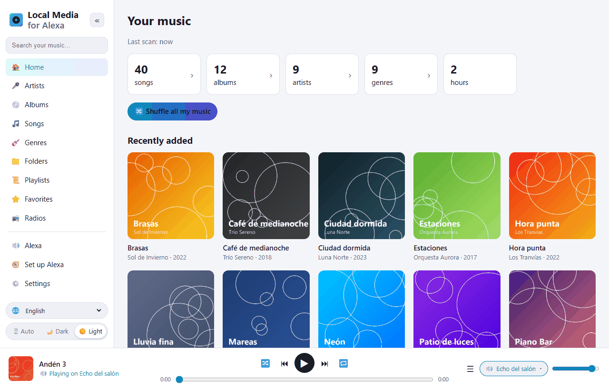
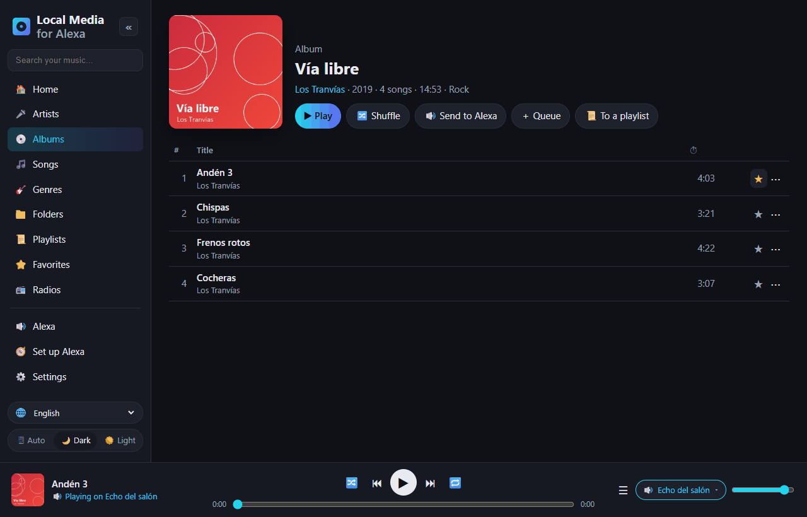
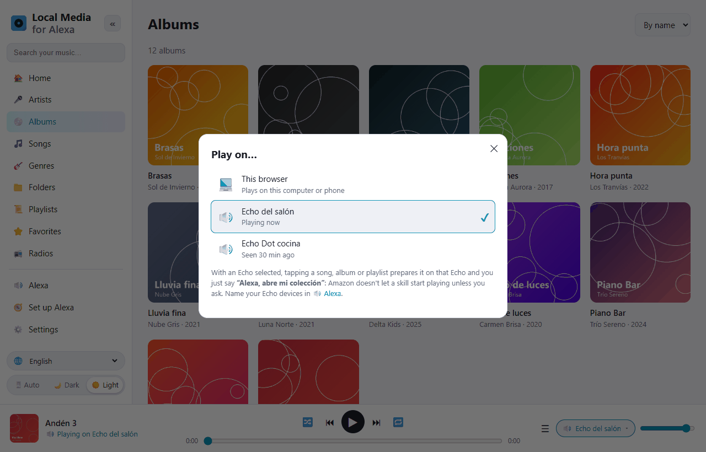
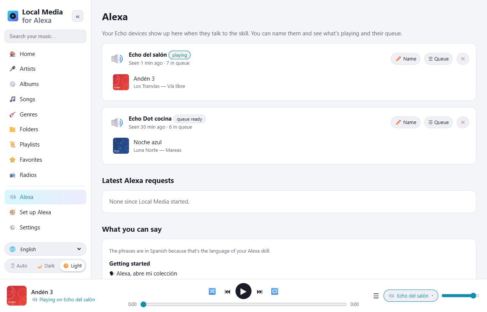
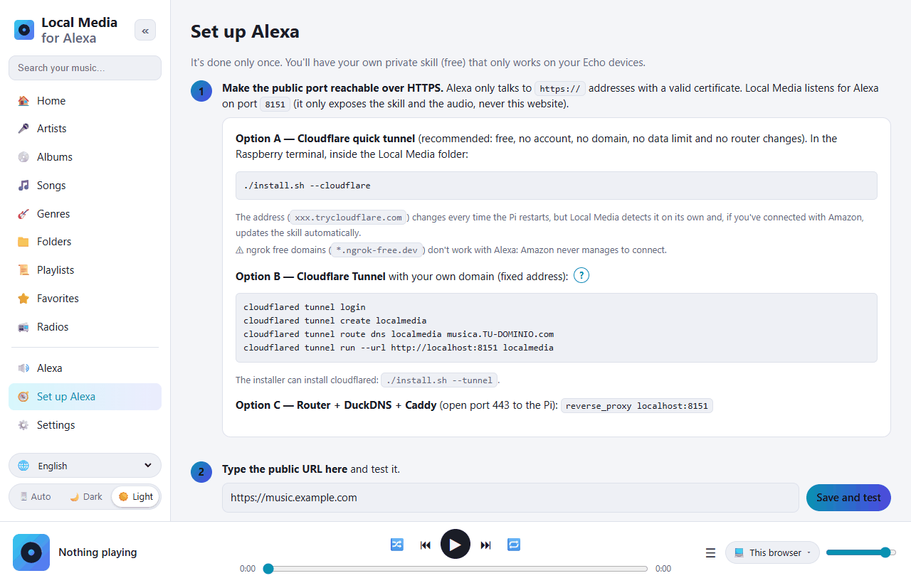

# Local Media for Alexa — your Raspberry Pi music on Alexa

[Español](README.md) · **English** · [Português](README.pt.md) · [Français](README.fr.md) · [Deutsch](README.de.md) · [Italiano](README.it.md) · [Polski](README.pl.md) · [Русский](README.ru.md) · [한국어](README.ko.md) · [日本語](README.ja.md)

A free, self-hosted alternative to *My Media for Alexa* for **Raspberry Pi / ARM Linux**
(it also runs on any x86 Linux or with Docker).
It scans your music (USB drive, SD card, mounted NAS or DLNA servers) and plays it
on your Echo devices by voice. Everything stays at home: no relay servers, no third-party accounts.



The Alexa skill works in **English** (US, UK) and **Spanish** (Spain, Mexico, US):

```
"Alexa, open my collection"
"Alexa, ask my collection to play Queen"
"Alexa, ask my collection to play the album Abbey Road"
"Alexa, ask my collection to play the song Bohemian Rhapsody"
"Alexa, ask my collection to play music from the eighties"
"Alexa, next" · "Alexa, shuffle" · "Alexa, ask my collection what's playing"
```

In Spanish: *“Alexa, abre mi colección”*, *“Alexa, pide a mi colección que ponga Queen”*…

## A quick look at the web app

The management web app opens from your phone or computer at home (`http://PI-IP:8080`).
It is translated into 10 languages (🌐 selector, bottom left) and has light and dark themes.

| | |
|---|---|
|  |  |
| **Browse your library** by artists, albums, songs, genres, folders, playlists and radios. Every track has a favorite ⭐ and a ⋯ menu (play next, add to queue, add to playlist…). | **Play on…**: play in the browser, or get the queue ready on the Echo you pick. Then just say *“Alexa, open my collection”*. |
|  |  |
| **Alexa**: your Echo devices, what each one is playing and its queue. Give them names. Below, every phrase you can say. | **Set up Alexa**: a step-by-step guide. The *Connect with Amazon* button creates the skill for you. |

## Installing on the Raspberry Pi

Requirements: Raspberry Pi 3/4/5 or Zero 2 W with Raspberry Pi OS (Bookworm or later).

```bash
sudo apt update && sudo apt install -y git
git clone https://github.com/DivolandiaLabs/Local-Media-for-Alexa.git
cd Local-Media-for-Alexa
chmod +x install.sh
./install.sh --cloudflare
```

Installer options:

```bash
./install.sh --music /media/pi/USB/Music    # add a music folder right away
./install.sh --cloudflare                   # Cloudflare quick tunnel: free HTTPS for Alexa (recommended)
./install.sh --tunnel                       # only install cloudflared (tunnel with your own domain)
```

Open `http://PI-IP:8080` from your phone or computer:

1. **Settings** → add folders → **Scan now**.
2. **Set up Alexa** → step-by-step guide (about 10 minutes, only once).

Update to the latest version:

```bash
cd ~/Local-Media-for-Alexa && git pull && ./install.sh
```

Then, in **Set up Alexa**, press **🗣 Update voice model** so the skill gets the new phrases.

With Docker: see the instructions at the top of the [Dockerfile](Dockerfile).

### Older Raspberry Pi OS (Bullseye / Buster)

Check your version with `cat /etc/os-release`. Raspberry Pi OS **Bullseye** (Debian 11) and
**Buster** (Debian 10) are no longer supported, and Debian is removing their packages from the
regular servers: `apt` fails with `404 Not Found`. Local Media runs on them
(it only needs Python 3.7+), but `apt` has to be able to install `python3-venv` and `ffmpeg`.

**Recommended:** flash a new card with the current Raspberry Pi OS (64-bit)
using [Raspberry Pi Imager](https://www.raspberrypi.com/software/). It is the only one
that keeps getting security updates.

**Quick fix (stay on Bullseye):** if `sudo apt update` complains about the Debian
repositories, point them to the archive and try again:

```bash
sudo cp /etc/apt/sources.list /etc/apt/sources.list.bak
echo "deb http://archive.debian.org/debian bullseye main contrib non-free" | sudo tee /etc/apt/sources.list
echo "deb http://archive.debian.org/debian-security bullseye-security main contrib non-free" | sudo tee -a /etc/apt/sources.list
sudo apt update
cd ~/Local-Media-for-Alexa && ./install.sh
```

(To undo: `sudo cp /etc/apt/sources.list.bak /etc/apt/sources.list`.)

## Features

| My Media for Alexa | Local Media |
|---|---|
| Play by artist, album, song, genre, playlist | ✅ with fuzzy search (copes with what Alexa mishears) |
| Play by folder | ✅ |
| By year / decade | ✅ "music from 1995", "from the nineties" |
| Whole library on shuffle | ✅ |
| Recently added / most played / favorites | ✅ |
| "More from this artist", "play this album" | ✅ |
| Next, previous, pause, resume, start over | ✅ |
| Shuffle and repeat | ✅ |
| Echo buttons and Alexa app controls | ✅ |
| "What's playing?" | ✅ |
| Cover art and title on Echo Show / Spot / app | ✅ (folder cover.jpg or embedded artwork) |
| M3U / M3U8 / PLS playlists | ✅ imported automatically when scanning |
| iTunes playlists | ✅ reads an exported `iTunes Library.xml` / `Library.xml` (File › Library › Export) |
| Shuffle an album, artist, playlist or genre | ✅ |
| Modes in your own words ("turn on loop mode", "turn off shuffle"…) | ✅ |
| "Add this to my playlist X" | ✅ (creates it if needed) |
| "Don't play this again" / "forget this track" | ✅ ignored list, restorable in Settings |
| Internet radio / streams ("play the station X") | ✅ 📻 Radios section in the web app, and .m3u/.pls files with http addresses |
| Audiobooks ("read X") | ✅ remembers where you left off |
| My Media phrasing: "Alexa, open my collection and play …" | ✅ |
| Your own playlists | ✅ created and edited in the web app, exportable to M3U |
| FLAC, WMA, OGG, OPUS, WAV, ALAC, APE… | ✅ on-the-fly MP3 transcoding with ffmpeg (with seeking/resume) |
| UPnP / DLNA servers (NAS, Plex, Jellyfin, MiniDLNA…) | ✅ |
| Several Echo devices, each with its own queue | ✅ |
| Alexa multi-room groups | ✅ (handled by Alexa) |
| Web app to browse the library | ✅ + in-browser player, dark mode, 10 languages |
| Prepare a queue in the web app and send it to an Echo | ✅ "Play on…" selector |
| Automatic rescan | ✅ incremental, every N minutes |
| Remote access | ✅ Cloudflare Tunnel / Caddy (no third-party relay servers) |
| Skill (voice) languages | ✅ es-ES, es-MX, es-US, en-US, en-GB |

## How it all fits together

```
Echo ──voice──▶ Amazon ──HTTPS──▶ tunnel (Cloudflare) ──▶ Pi :8765  /alexa   (skill)
Echo ◀────────────────── HTTPS audio ─────────────────── Pi :8765  /s/<secret>/…
You (phone/PC, at home) ────────────────────────────────▶ Pi :8080  management web app
```

* **Port 8765** is the only one exposed to the Internet: it only answers Alexa (with Amazon's
  signature verified) and serves audio and artwork behind a random secret key.
* **Port 8080** (the web app) stays on your local network. You can set a password.
* Alexa requires HTTPS with a valid certificate, so you need a tunnel or a proxy.
  The easiest option is the Cloudflare quick tunnel (`./install.sh --cloudflare`):
  free, no account and no domain. Its address changes on reboot, but Local Media
  detects it and updates the skill by itself.

## The Alexa skill

It is a **private skill in development mode**: it is never published, it is free and it works on
every Echo on your account. Local Media builds the voice model **with the names in your library**
so Alexa recognizes them better. [skill/](skill) also contains a generic model and
the `skill.json` manifest (for `ask-cli`).

### Connect with Amazon (automatic)

In **Set up Alexa** there is a **CONNECT WITH AMAZON** button: you sign in with your Amazon
account and Local Media creates the skill by itself (voice model with your library, audio
player, endpoint and enablement on your Echo devices). After that it re-uploads the voice model
whenever a scan changes the library.

Before that, only once, Amazon asks you to create a **Login with Amazon security profile**
(the web app tells you what to paste in each field):

1. [Login with Amazon](https://developer.amazon.com/loginwithamazon/console/site/lwa/overview.html)
   → *Create a New Security Profile* → name, description and, as *Consent Privacy Notice URL*,
   `https://YOUR-PUBLIC-URL/privacidad`.
2. *Web Settings* → *Allowed Return URLs*: `https://YOUR-PUBLIC-URL/amazon/callback`.
3. Copy the *Client ID* and *Client Secret* into Local Media.

The secret and Amazon permissions are stored only on your Pi (`~/.localmedia/config.json`,
mode 600) and are never shown in the web app. *Disconnect* deletes them; the skill keeps
working.

Invocation name: **"my collection"** (in Spanish *"mi colección"*). You can change it
in the Alexa console (*Invocation*); Local Media does not depend on it.

Alexa skills cannot start playing on their own: when you prepare a queue on an Echo
from the web app, say *"Alexa, open my collection"* to start it.

## Languages

* **Web app:** Spanish, English, Portuguese, French, German, Italian, Polish, Russian, Korean and Japanese.
  Choose with the 🌐 selector (defaults to your browser language).
* **Voice (Alexa skill):** Spanish (Spain, Mexico, US) and English (US, UK).
  Alexa does not offer custom skills in Korean, Russian or Polish.

## Troubleshooting

| Symptom | Fix |
|---|---|
| "There was a problem with the requested skill's response" | Check `journalctl -u localmedia -f`. If it says the request is too old, the Pi's clock is wrong (`timedatectl`). |
| Alexa answers but nothing plays | The public URL is not reachable over HTTPS or has no valid certificate. Use the *Save and test* button in the guide. |
| I use ngrok and Alexa cannot connect | Free ngrok domains do not work with Alexa. Use `./install.sh --cloudflare`. |
| FLAC files don't play | ffmpeg is missing: `sudo apt install ffmpeg`. |
| Alexa doesn't understand an unusual name | Press **🗣 Update voice model** in *Set up Alexa* (it includes your library). |
| Tracks from a NAS don't show up | Mount the share (`/etc/fstab`, CIFS/NFS) and add it, or enable UPnP/DLNA in Settings. |

Useful commands:

```bash
journalctl -u localmedia -f          # see what's going on
sudo systemctl restart localmedia    # restart
./uninstall.sh                       # remove the service (your music is not deleted)
```

## Files

```
localmedia/          the program (Python 3.9+)
  alexa.py           intents, per-device queues, AudioPlayer events
  alexa_verify.py    Amazon signature and certificate verification
  amazon.py          Login with Amazon and automatic skill creation
  tunnel.py          follows the Cloudflare quick tunnel address
  library.py         scanning, tags (mutagen), artwork, playlists, search
  media.py           audio streaming with seeking and ffmpeg transcoding
  upnp.py            UPnP/DLNA client
  skillmodel.py      builds the skill's voice model
  web.py             public server (Alexa) and management web app
  static/            the web app (static/i18n/ = translations)
skill/               generic voice model and skill manifest
docs/screenshots/    screenshots used in this README
install.sh           installer for Raspberry Pi OS / Debian
```

Data (settings, database, artwork cache): `~/.localmedia/`.
