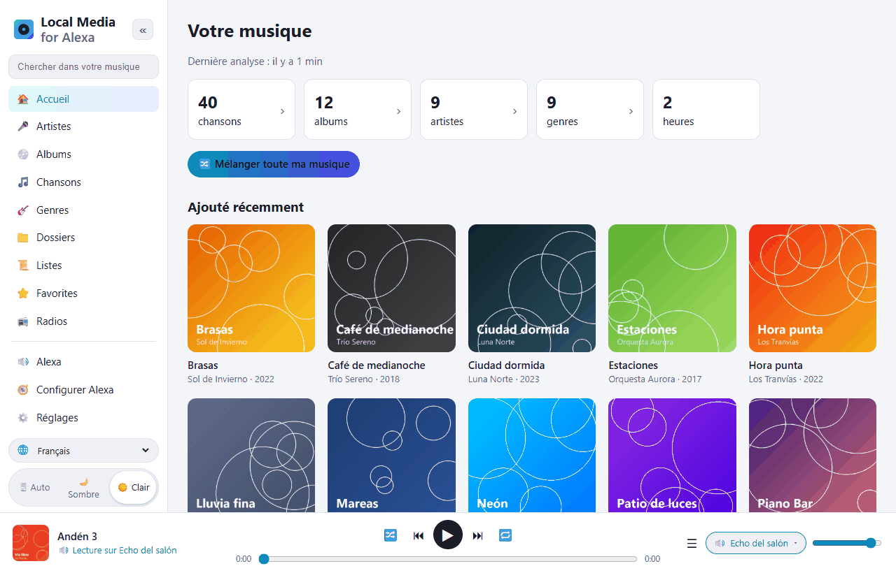
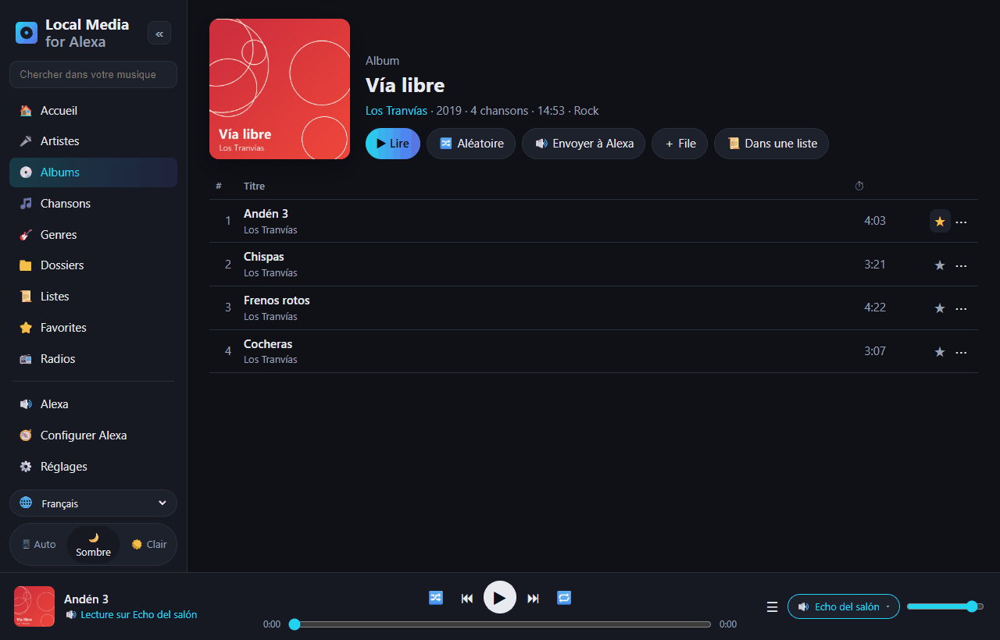
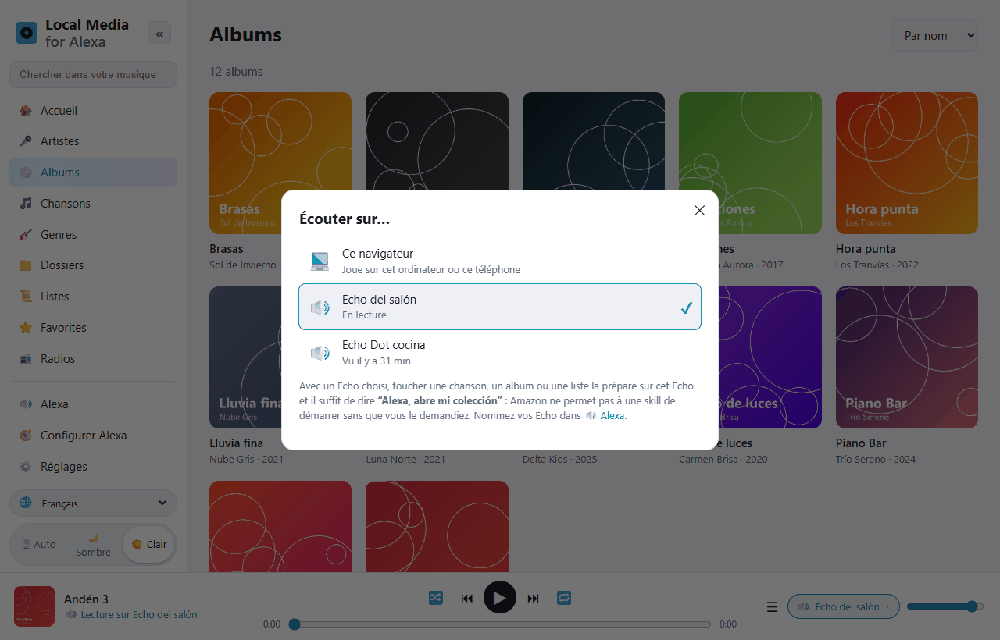
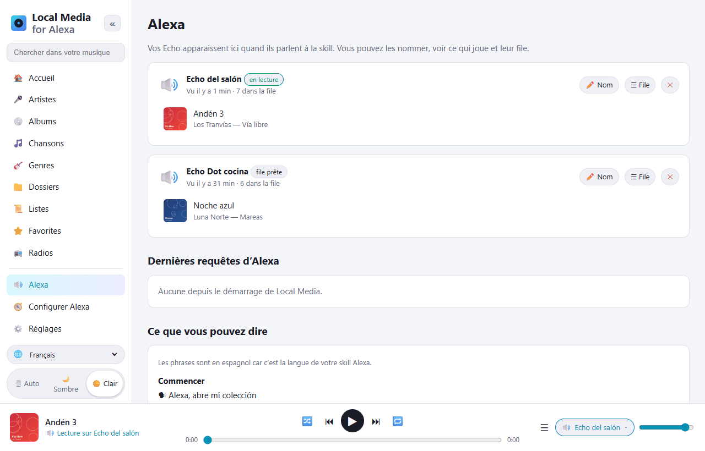
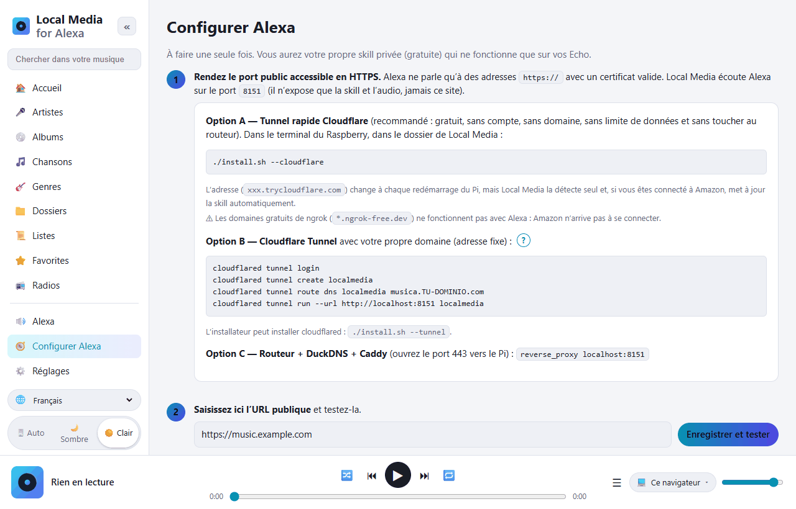

# Local Media for Alexa — la musique de votre Raspberry Pi sur Alexa

[Español](README.md) · [English](README.en.md) · [Português](README.pt.md) · **Français** · [Deutsch](README.de.md) · [Italiano](README.it.md) · [Polski](README.pl.md) · [Русский](README.ru.md) · [한국어](README.ko.md) · [日本語](README.ja.md)

Alternative libre et auto-hébergée à *My Media for Alexa* pour **Raspberry Pi / Linux ARM**
(fonctionne aussi sur n'importe quel Linux x86 ou avec Docker).
Elle analyse votre musique (disque USB, carte SD, NAS monté ou serveurs DLNA) et la joue
sur vos Echo à la voix. Tout reste chez vous : aucun serveur intermédiaire, aucun compte tiers.



La skill Alexa fonctionne en **espagnol** (Espagne, Mexique, États-Unis) et en **anglais** (États-Unis, Royaume-Uni).
Les phrases se disent dans la langue de la skill :

```
"Alexa, abre mi colección"
"Alexa, pide a mi colección que ponga Queen"
"Alexa, pide a mi colección que ponga el disco Abbey Road"
"Alexa, abre mi colección reproduzca la pista Bohemian Rhapsody"
"Alexa, siguiente" · "Alexa, aleatorio" · "Alexa, pide a mi colección qué está sonando"
```

En anglais : *“Alexa, open my collection”*, *“Alexa, ask my collection to play Queen”*…

## Aperçu de l'interface web

L'interface de gestion s'ouvre depuis le téléphone ou l'ordinateur de la maison (`http://IP-DU-PI:8080`).
Elle est traduite en 10 langues (sélecteur 🌐 en bas à gauche) et propose un thème clair et un thème sombre.

| | |
|---|---|
|  |  |
| **Parcourez votre bibliothèque** par artistes, albums, titres, genres, dossiers, listes et radios. Chaque titre a un favori ⭐ et un menu ⋯ (lire ensuite, ajouter à la file, à une liste…). | **Écouter sur…** : lecture dans le navigateur, ou file préparée sur l'Echo de votre choix. Il suffit ensuite de dire *« Alexa, abre mi colección »*. |
|  |  |
| **Alexa** : vos Echo, ce que chacun joue et sa file d'attente. Donnez-leur un nom. En dessous, toutes les phrases que vous pouvez dire. | **Configurer Alexa** : un guide pas à pas. Le bouton *Se connecter à Amazon* crée la skill tout seul. |

## Installation sur le Raspberry Pi

Prérequis : Raspberry Pi 3/4/5 ou Zero 2 W avec Raspberry Pi OS (Bookworm ou plus récent).

```bash
sudo apt update && sudo apt install -y git
git clone https://github.com/DivolandiaLabs/Local-Media-for-Alexa.git
cd Local-Media-for-Alexa
chmod +x install.sh
./install.sh --cloudflare
```

Options de l'installateur :

```bash
./install.sh --music /media/pi/USB/Musique  # ajoute tout de suite un dossier de musique
./install.sh --cloudflare                   # tunnel rapide Cloudflare : HTTPS gratuit pour Alexa (recommandé)
./install.sh --tunnel                       # installe seulement cloudflared (tunnel avec votre propre domaine)
```

Ouvrez `http://IP-DU-PI:8080` depuis le téléphone ou l'ordinateur :

1. **Réglages** → ajoutez des dossiers → **Analyser maintenant**.
2. **Configurer Alexa** → guide pas à pas (environ 10 minutes, une seule fois).

Mettre à jour vers la dernière version :

```bash
cd ~/Local-Media-for-Alexa && git pull && ./install.sh
```

Ensuite, dans **Configurer Alexa**, appuyez sur **🗣 Mettre à jour le modèle vocal** pour que la skill reçoive les nouvelles phrases.

Avec Docker : voir les instructions en tête du [Dockerfile](Dockerfile).

### Ancien Raspberry Pi OS (Bullseye / Buster)

Vérifiez votre version avec `cat /etc/os-release`. Raspberry Pi OS **Bullseye** (Debian 11) et
**Buster** (Debian 10) ne sont plus pris en charge, et Debian retire leurs paquets des
serveurs habituels : `apt` renvoie des erreurs `404 Not Found`. Local Media y fonctionne
(il lui faut seulement Python 3.7+), mais `apt` doit pouvoir installer `python3-venv` et `ffmpeg`.

**Option recommandée :** graver une nouvelle carte avec le Raspberry Pi OS actuel (64 bits)
grâce à [Raspberry Pi Imager](https://www.raspberrypi.com/software/). C'est le seul qui
reçoit encore des mises à jour de sécurité.

**Option rapide (rester sur Bullseye) :** si `sudo apt update` se plaint des
dépôts Debian, faites-les pointer vers les archives et réessayez :

```bash
sudo cp /etc/apt/sources.list /etc/apt/sources.list.bak
echo "deb http://archive.debian.org/debian bullseye main contrib non-free" | sudo tee /etc/apt/sources.list
echo "deb http://archive.debian.org/debian-security bullseye-security main contrib non-free" | sudo tee -a /etc/apt/sources.list
sudo apt update
cd ~/Local-Media-for-Alexa && ./install.sh
```

(Pour revenir en arrière : `sudo cp /etc/apt/sources.list.bak /etc/apt/sources.list`.)

## Fonctionnalités

| My Media for Alexa | Local Media |
|---|---|
| Lecture par artiste, album, titre, genre, liste | ✅ avec recherche approximative (tolère ce qu'Alexa entend mal) |
| Lecture par dossier | ✅ |
| Par année / décennie | ✅ « musique de 1995 », « des années quatre-vingt-dix » |
| Toute la bibliothèque en aléatoire | ✅ |
| Ajouts récents / plus écoutés / favoris | ✅ |
| « Plus de cet artiste », « mets cet album » | ✅ |
| Suivant, précédent, pause, reprendre, recommencer | ✅ |
| Aléatoire et répétition | ✅ |
| Boutons de l'Echo et de l'app Alexa | ✅ |
| « Qu'est-ce qui joue ? » | ✅ |
| Pochette et titre sur Echo Show / Spot / app | ✅ (cover.jpg du dossier ou pochette intégrée) |
| Listes M3U / M3U8 / PLS | ✅ importées automatiquement à l'analyse |
| Playlists iTunes | ✅ lit le `iTunes Library.xml` / `Library.xml` exporté (Fichier › Bibliothèque › Exporter) |
| Aléatoire sur un album, artiste, playlist ou genre | ✅ |
| Modes avec vos propres mots (« active le mode boucle », « désactive l'aléatoire »…) | ✅ |
| « Ajoute celle-ci à ma playlist X » | ✅ (la crée si besoin) |
| « Ne remets plus celle-ci » / « oublie ce titre » | ✅ liste des ignorés, récupérable dans les Réglages |
| Radios / flux Internet (« mets la station X ») | ✅ rubrique 📻 Radios dans l'interface et fichiers .m3u/.pls avec adresses http |
| Livres audio (« lis X ») | ✅ se souvient où vous en étiez |
| Tournure de My Media : « Alexa, abre mi colección reproduzca … » | ✅ |
| Vos propres listes | ✅ créées et modifiées dans l'interface, exportables en M3U |
| FLAC, WMA, OGG, OPUS, WAV, ALAC, APE… | ✅ conversion à la volée en MP3 avec ffmpeg (avec avance/reprise) |
| Serveurs UPnP / DLNA (NAS, Plex, Jellyfin, MiniDLNA…) | ✅ |
| Plusieurs Echo, chacun avec sa file | ✅ |
| Groupes multiroom d'Alexa | ✅ (gérés par Alexa) |
| Interface web pour parcourir la bibliothèque | ✅ + lecteur dans le navigateur, mode sombre, 10 langues |
| Préparer une file dans l'interface et l'envoyer à un Echo | ✅ sélecteur « Écouter sur… » |
| Nouvelle analyse automatique | ✅ incrémentale, toutes les N minutes |
| Accès à distance | ✅ Cloudflare Tunnel / Caddy (sans serveur intermédiaire tiers) |
| Langues de la skill (voix) | ✅ es-ES, es-MX, es-US, en-US, en-GB |

## Comment tout s'articule

```
Echo ──voix──▶ Amazon ──HTTPS──▶ tunnel (Cloudflare) ──▶ Pi :8765  /alexa   (skill)
Echo ◀──────────────── audio HTTPS ──────────────────── Pi :8765  /s/<secret>/…
Vous (téléphone/PC, à la maison) ─────────────────────▶ Pi :8080  interface de gestion
```

* Le **port 8765** est le seul exposé à Internet : il ne répond qu'à Alexa (signature
  d'Amazon vérifiée) et sert l'audio et les pochettes derrière une clé secrète aléatoire.
* Le **port 8080** (l'interface web) reste sur votre réseau local. Vous pouvez y mettre un mot de passe.
* Alexa exige HTTPS avec un certificat valide, il faut donc un tunnel ou un proxy.
  Le plus simple est le tunnel rapide Cloudflare (`./install.sh --cloudflare`) :
  gratuit, sans compte ni domaine. Son adresse change au redémarrage, mais Local Media
  la détecte et met la skill à jour tout seul.

## La skill Alexa

C'est une skill **privée en mode développement** : elle n'est jamais publiée, elle est gratuite et fonctionne
sur tous les Echo de votre compte. Local Media génère le modèle vocal **avec les noms de votre bibliothèque**
pour qu'Alexa les reconnaisse mieux. Le dossier [skill/](skill) contient aussi un modèle générique et
le manifeste `skill.json` (pour `ask-cli`).

### Se connecter à Amazon (automatique)

Dans **Configurer Alexa** se trouve le bouton **SE CONNECTER À AMAZON** : vous vous connectez avec votre
compte Amazon et Local Media crée la skill tout seul (modèle vocal avec votre bibliothèque, lecteur
audio, adresse et activation sur vos Echo). Ensuite, il renvoie le modèle vocal
chaque fois qu'une analyse modifie la bibliothèque.

Avant cela, une seule fois, Amazon demande de créer un **profil de sécurité Login with Amazon**
(l'interface vous indique quoi coller dans chaque champ) :

1. [Login with Amazon](https://developer.amazon.com/loginwithamazon/console/site/lwa/overview.html)
   → *Create a New Security Profile* → nom, description et, comme *Consent Privacy Notice URL*,
   `https://VOTRE-URL-PUBLIQUE/privacidad`.
2. *Web Settings* → *Allowed Return URLs* : `https://VOTRE-URL-PUBLIQUE/amazon/callback`.
3. Copiez le *Client ID* et le *Client Secret* dans Local Media.

Le secret et les autorisations Amazon sont stockés uniquement sur votre Pi (`~/.localmedia/config.json`,
droits 600) et ne sont jamais affichés dans l'interface. *Se déconnecter* les efface ; la skill continue
de fonctionner.

Nom d'invocation : **« mi colección »** (en anglais *« my collection »*). On peut le changer
dans la console Alexa (*Invocation*) ; Local Media n'en dépend pas.

Les skills Alexa ne peuvent pas lancer la lecture d'elles-mêmes : quand vous préparez une file
sur un Echo depuis l'interface, dites *« Alexa, abre mi colección »* pour qu'elle démarre.

## Langues

* **Interface web :** espagnol, anglais, portugais, français, allemand, italien, polonais, russe, coréen et japonais.
  À choisir avec le sélecteur 🌐 (par défaut, la langue du navigateur).
* **Voix (skill Alexa) :** espagnol (Espagne, Mexique, États-Unis) et anglais (États-Unis, Royaume-Uni).

## Problèmes fréquents

| Symptôme | Solution |
|---|---|
| « Un problème est survenu avec la réponse de la skill demandée » | Consultez `journalctl -u localmedia -f`. Si la requête est jugée trop ancienne, l'horloge du Pi est fausse (`timedatectl`). |
| Alexa répond mais rien ne joue | L'URL publique n'est pas accessible en HTTPS ou n'a pas de certificat valide. Utilisez le bouton *Enregistrer et tester* du guide. |
| J'utilise ngrok et Alexa ne se connecte pas | Les domaines gratuits de ngrok ne fonctionnent pas avec Alexa. Utilisez `./install.sh --cloudflare`. |
| Les FLAC ne jouent pas | ffmpeg manque : `sudo apt install ffmpeg`. |
| Alexa ne comprend pas un nom inhabituel | Appuyez sur **🗣 Mettre à jour le modèle vocal** dans *Configurer Alexa* (il inclut votre bibliothèque). |
| Les titres d'un NAS n'apparaissent pas | Montez le partage (`/etc/fstab`, CIFS/NFS) et ajoutez-le, ou activez UPnP/DLNA dans les Réglages. |

Commandes utiles :

```bash
journalctl -u localmedia -f          # voir ce qui se passe
sudo systemctl restart localmedia    # redémarrer
./uninstall.sh                       # retirer le service (votre musique n'est pas supprimée)
```

## Fichiers

```
localmedia/          le programme (Python 3.9+)
  alexa.py           intents, files par appareil, événements AudioPlayer
  alexa_verify.py    vérification de la signature et du certificat d'Amazon
  amazon.py          Login with Amazon et création automatique de la skill
  tunnel.py          suit l'adresse du tunnel rapide Cloudflare
  library.py         analyse, tags (mutagen), pochettes, listes, recherche
  media.py           envoi audio avec avance et conversion ffmpeg
  upnp.py            client UPnP/DLNA
  skillmodel.py      génère le modèle vocal de la skill
  web.py             serveur public (Alexa) et interface de gestion
  static/            l'interface web (static/i18n/ = traductions)
skill/               modèle vocal générique et manifeste de la skill
docs/screenshots/    captures de ce README
install.sh           installateur pour Raspberry Pi OS / Debian
```

Données (réglages, base de données, cache des pochettes) : `~/.localmedia/`.
