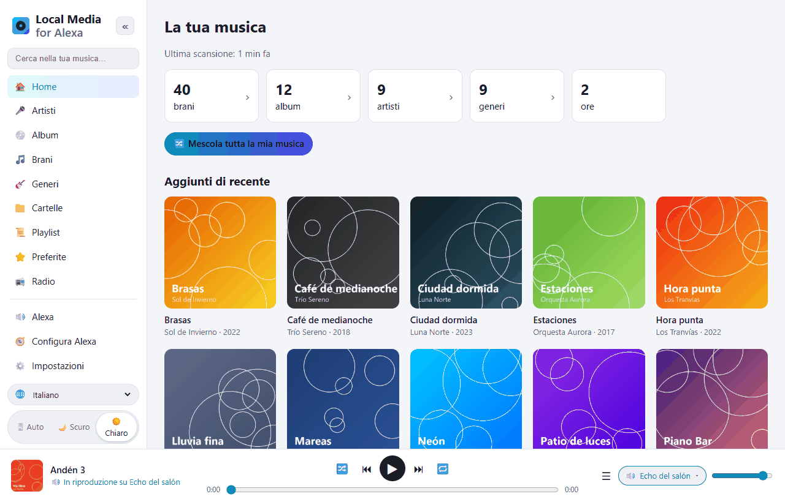
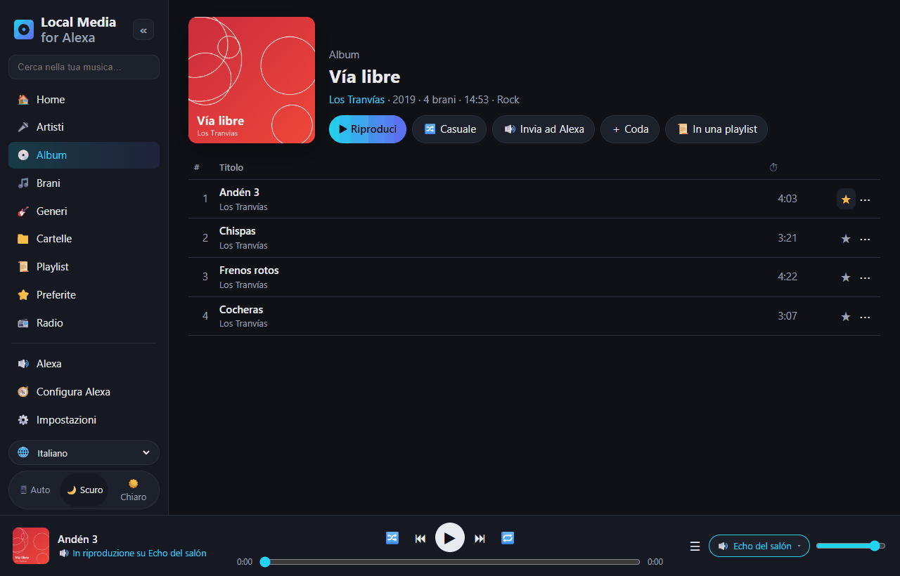
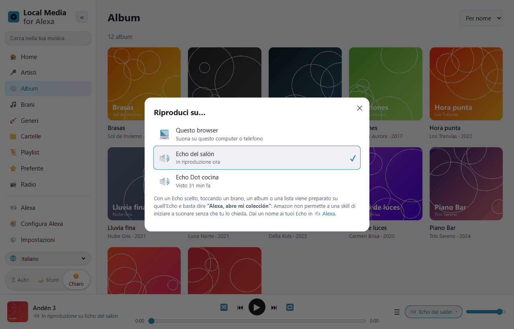
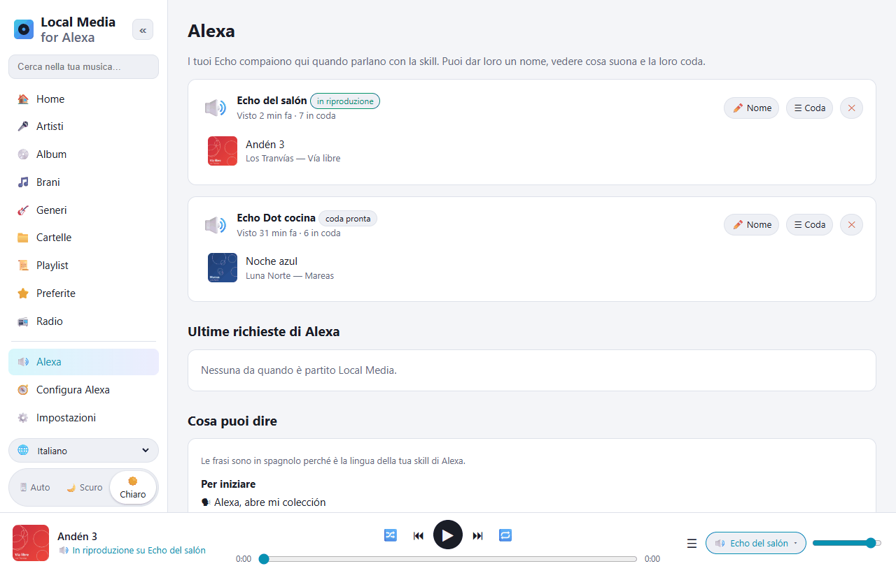
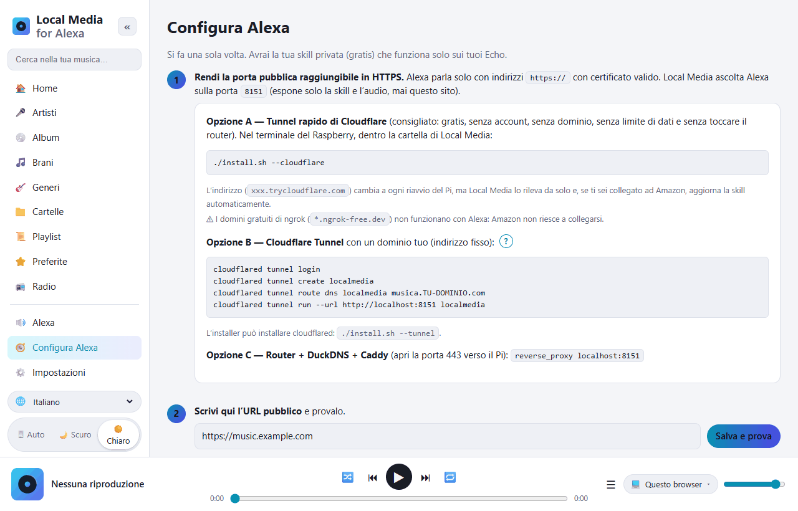

# Local Media for Alexa — la musica del tuo Raspberry Pi su Alexa

[Español](README.md) · [English](README.en.md) · [Português](README.pt.md) · [Français](README.fr.md) · [Deutsch](README.de.md) · **Italiano** · [Polski](README.pl.md) · [Русский](README.ru.md) · [한국어](README.ko.md) · [日本語](README.ja.md)

Alternativa libera e self-hosted a *My Media for Alexa* per **Raspberry Pi / Linux ARM**
(funziona anche su qualsiasi Linux x86 o con Docker).
Scansiona la tua musica (disco USB, scheda SD, NAS montato o server DLNA) e la riproduce
sui tuoi Echo con la voce. Tutto resta a casa tua: nessun server intermedio, nessun account di terzi.



La skill di Alexa funziona in **spagnolo** (Spagna, Messico, USA) e **inglese** (USA, Regno Unito).
Le frasi si dicono nella lingua della skill:

```
"Alexa, abre mi colección"
"Alexa, pide a mi colección que ponga Queen"
"Alexa, pide a mi colección que ponga el disco Abbey Road"
"Alexa, abre mi colección reproduzca la pista Bohemian Rhapsody"
"Alexa, siguiente" · "Alexa, aleatorio" · "Alexa, pide a mi colección qué está sonando"
```

In inglese: *“Alexa, open my collection”*, *“Alexa, ask my collection to play Queen”*…

## Uno sguardo all'interfaccia web

L'interfaccia di gestione si apre dal telefono o dal computer di casa (`http://IP-DEL-PI:8080`).
È tradotta in 10 lingue (selettore 🌐 in basso a sinistra) e ha il tema chiaro e scuro.

| | |
|---|---|
|  |  |
| **Esplora la tua libreria** per artisti, album, brani, generi, cartelle, playlist e radio. Ogni brano ha il preferito ⭐ e il menu ⋯ (riproduci dopo, in coda, in una playlist…). | **Riproduci su…**: suona nel browser oppure si prepara sull'Echo che scegli. Poi basta dire *“Alexa, abre mi colección”*. |
|  |  |
| **Alexa**: i tuoi Echo, cosa suona su ciascuno e la sua coda. Dai loro un nome. Sotto, tutte le frasi che puoi dire. | **Configura Alexa**: guida passo passo. Con il pulsante *Collegati ad Amazon* la skill si crea da sola. |

## Installazione sul Raspberry Pi

Requisiti: Raspberry Pi 3/4/5 o Zero 2 W con Raspberry Pi OS (Bookworm o successivo).

```bash
sudo apt update && sudo apt install -y git
git clone https://github.com/DivolandiaLabs/Local-Media-for-Alexa.git
cd Local-Media-for-Alexa
chmod +x install.sh
./install.sh --cloudflare
```

Opzioni dell'installer:

```bash
./install.sh --music /media/pi/USB/Musica   # aggiunge subito una cartella di musica
./install.sh --cloudflare                   # tunnel rapido Cloudflare: HTTPS gratuito per Alexa (consigliato)
./install.sh --tunnel                       # installa solo cloudflared (tunnel con dominio proprio)
```

Apri `http://IP-DEL-PI:8080` dal telefono o dal computer:

1. **Impostazioni** → aggiungi cartelle → **Scansiona ora**.
2. **Configura Alexa** → guida passo passo (circa 10 minuti, una sola volta).

Aggiornare all'ultima versione:

```bash
cd ~/Local-Media-for-Alexa && git pull && ./install.sh
```

Poi, in **Configura Alexa**, premi **🗣 Aggiorna modello vocale** perché la skill riceva le nuove frasi.

Con Docker: vedi le istruzioni all'inizio del [Dockerfile](Dockerfile).

### Raspberry Pi OS vecchio (Bullseye / Buster)

Controlla la tua versione con `cat /etc/os-release`. Raspberry Pi OS **Bullseye** (Debian 11) e
**Buster** (Debian 10) non sono più supportati, e Debian sta togliendo i loro pacchetti dai
server normali: `apt` dà errori `404 Not Found`. Local Media funziona su di essi
(serve solo Python 3.7+), ma `apt` deve riuscire a installare `python3-venv` e `ffmpeg`.

**Opzione consigliata:** scrivere una nuova scheda con il Raspberry Pi OS attuale (64 bit)
usando [Raspberry Pi Imager](https://www.raspberrypi.com/software/). È l'unico che
continua a ricevere aggiornamenti di sicurezza.

**Opzione rapida (restare su Bullseye):** se `sudo apt update` si lamenta dei
repository Debian, puntali all'archivio storico e riprova:

```bash
sudo cp /etc/apt/sources.list /etc/apt/sources.list.bak
echo "deb http://archive.debian.org/debian bullseye main contrib non-free" | sudo tee /etc/apt/sources.list
echo "deb http://archive.debian.org/debian-security bullseye-security main contrib non-free" | sudo tee -a /etc/apt/sources.list
sudo apt update
cd ~/Local-Media-for-Alexa && ./install.sh
```

(Per tornare indietro: `sudo cp /etc/apt/sources.list.bak /etc/apt/sources.list`.)

## Funzioni

| My Media for Alexa | Local Media |
|---|---|
| Riproduzione per artista, album, brano, genere, playlist | ✅ con ricerca approssimata (tollera ciò che Alexa capisce male) |
| Riproduzione per cartella | ✅ |
| Per anno / decennio | ✅ "musica del 1995", "degli anni novanta" |
| Tutta la libreria in casuale | ✅ |
| Aggiunti di recente / più ascoltati / preferiti | ✅ |
| "Altro di questo artista", "metti questo album" | ✅ |
| Avanti, indietro, pausa, riprendi, ricomincia | ✅ |
| Casuale e ripetizione | ✅ |
| Tasti dell'Echo e comandi dell'app Alexa | ✅ |
| "Cosa sta suonando?" | ✅ |
| Copertina e titolo su Echo Show / Spot / app | ✅ (cover.jpg della cartella o copertina incorporata) |
| Playlist M3U / M3U8 / PLS | ✅ importate automaticamente durante la scansione |
| Playlist di iTunes | ✅ legge `iTunes Library.xml` / `Library.xml` esportato (Archivio › Libreria › Esporta) |
| Casuale di un album, artista, playlist o genere | ✅ |
| Modalità con parole tue ("attiva la modalità loop", "disattiva lo shuffle"…) | ✅ |
| "Aggiungi questa alla mia playlist X" | ✅ (la crea se non esiste) |
| "Non mettere più questa" / "dimentica questo brano" | ✅ elenco degli ignorati, recuperabile nelle Impostazioni |
| Radio / stream Internet ("metti la stazione X") | ✅ sezione 📻 Radio nell'interfaccia e .m3u/.pls con indirizzi http |
| Audiolibri ("leggi X") | ✅ ricorda dove eri arrivato |
| Forma di frase di My Media: "Alexa, abre mi colección reproduzca …" | ✅ |
| Playlist tue | ✅ create e modificate nell'interfaccia, esportabili in M3U |
| FLAC, WMA, OGG, OPUS, WAV, ALAC, APE… | ✅ conversione al volo in MP3 con ffmpeg (con salti/ripresa) |
| Server UPnP / DLNA (NAS, Plex, Jellyfin, MiniDLNA…) | ✅ |
| Più Echo, ognuno con la sua coda | ✅ |
| Gruppi multi-stanza di Alexa | ✅ (gestiti da Alexa) |
| Interfaccia web per esplorare la libreria | ✅ + lettore nel browser, modalità scura, 10 lingue |
| Preparare una coda sul web e inviarla a un Echo | ✅ selettore "Riproduci su…" |
| Nuova scansione automatica | ✅ incrementale, ogni N minuti |
| Accesso remoto | ✅ Cloudflare Tunnel / Caddy (senza server intermedi di terzi) |
| Lingue della skill (voce) | ✅ es-ES, es-MX, es-US, en-US, en-GB |

## Come si incastra tutto

```
Echo ──voce──▶ Amazon ──HTTPS──▶ tunnel (Cloudflare) ──▶ Pi :8765  /alexa   (skill)
Echo ◀──────────────── audio HTTPS ──────────────────── Pi :8765  /s/<segreto>/…
Tu (telefono/PC, a casa) ─────────────────────────────▶ Pi :8080  interfaccia di gestione
```

* La **porta 8765** è l'unica esposta a Internet: risponde solo ad Alexa (con la firma
  di Amazon verificata) e serve audio e copertine dietro una chiave segreta casuale.
* La **porta 8080** (l'interfaccia web) resta nella tua rete locale. Puoi metterle una password.
* Alexa richiede HTTPS con un certificato valido, quindi serve un tunnel o un proxy.
  L'opzione più semplice è il tunnel rapido Cloudflare (`./install.sh --cloudflare`):
  gratuito, senza account né dominio. Il suo indirizzo cambia al riavvio, ma Local Media
  lo rileva e aggiorna la skill da solo.

## La skill di Alexa

È una skill **privata in modalità sviluppo**: non viene pubblicata, è gratuita e funziona su tutti
gli Echo del tuo account. Local Media genera il modello vocale **con i nomi della tua libreria**
perché Alexa li riconosca meglio. In [skill/](skill) ci sono anche un modello generico e
il manifesto `skill.json` (per `ask-cli`).

### Collegati ad Amazon (automatico)

In **Configura Alexa** c'è il pulsante **COLLEGATI AD AMAZON**: accedi con il tuo account
Amazon e Local Media crea la skill da solo (modello vocale con la tua libreria, lettore
audio, indirizzo e attivazione sui tuoi Echo). Dopo, ricarica il modello vocale
ogni volta che una scansione cambia la libreria.

Prima, una sola volta, Amazon chiede di creare un **profilo di sicurezza di Login with Amazon**
(l'interfaccia ti dice cosa incollare in ogni campo):

1. [Login with Amazon](https://developer.amazon.com/loginwithamazon/console/site/lwa/overview.html)
   → *Create a New Security Profile* → nome, descrizione e, come *Consent Privacy Notice URL*,
   `https://IL-TUO-URL-PUBBLICO/privacidad`.
2. *Web Settings* → *Allowed Return URLs*: `https://IL-TUO-URL-PUBBLICO/amazon/callback`.
3. Copia il *Client ID* e il *Client Secret* in Local Media.

Il segreto e i permessi di Amazon sono salvati solo sul tuo Pi (`~/.localmedia/config.json`,
permessi 600) e non vengono mai mostrati nell'interfaccia. *Scollega* li cancella; la skill continua
a funzionare.

Nome di invocazione: **"mi colección"** (in inglese *"my collection"*). Si può cambiare
nella console di Alexa (*Invocation*); Local Media non dipende da esso.

Le skill di Alexa non possono iniziare a suonare di propria iniziativa: quando prepari una coda
su un Echo dall'interfaccia, di' *"Alexa, abre mi colección"* per farla partire.

## Lingue

* **Interfaccia web:** spagnolo, inglese, portoghese, francese, tedesco, italiano, polacco, russo, coreano e giapponese.
  Si sceglie con il selettore 🌐 (di default, la lingua del browser).
* **Voce (skill di Alexa):** spagnolo (Spagna, Messico, USA) e inglese (USA, Regno Unito).

## Problemi frequenti

| Sintomo | Soluzione |
|---|---|
| "Si è verificato un problema con la risposta della skill richiesta" | Controlla `journalctl -u localmedia -f`. Se dice che la richiesta è troppo vecchia, l'ora del Pi è sbagliata (`timedatectl`). |
| Alexa risponde ma non suona nulla | L'URL pubblico non è raggiungibile in HTTPS o non ha un certificato valido. Usa il pulsante *Salva e prova* della guida. |
| Uso ngrok e Alexa non si collega | I domini gratuiti di ngrok non funzionano con Alexa. Usa `./install.sh --cloudflare`. |
| I FLAC non suonano | Manca ffmpeg: `sudo apt install ffmpeg`. |
| Alexa non capisce un nome strano | Premi **🗣 Aggiorna modello vocale** in *Configura Alexa* (include la tua libreria). |
| I brani di un NAS non compaiono | Monta la cartella condivisa (`/etc/fstab`, CIFS/NFS) e aggiungila, oppure attiva UPnP/DLNA nelle Impostazioni. |

Comandi utili:

```bash
journalctl -u localmedia -f          # vedere cosa succede
sudo systemctl restart localmedia    # riavviare
./uninstall.sh                       # rimuovere il servizio (la tua musica non viene cancellata)
```

## File

```
localmedia/          il programma (Python 3.9+)
  alexa.py           intent, code per dispositivo, eventi dell'AudioPlayer
  alexa_verify.py    verifica della firma e del certificato di Amazon
  amazon.py          Login with Amazon e creazione automatica della skill
  tunnel.py          segue l'indirizzo del tunnel rapido Cloudflare
  library.py         scansione, tag (mutagen), copertine, playlist, ricerca
  media.py           invio audio con salti e conversione con ffmpeg
  upnp.py            client UPnP/DLNA
  skillmodel.py      genera il modello vocale della skill
  web.py             server pubblico (Alexa) e interfaccia di gestione
  static/            l'interfaccia web (static/i18n/ = traduzioni)
skill/               modello vocale generico e manifesto della skill
docs/screenshots/    schermate di questo README
install.sh           installer per Raspberry Pi OS / Debian
```

Dati (impostazioni, database, cache delle copertine): `~/.localmedia/`.
