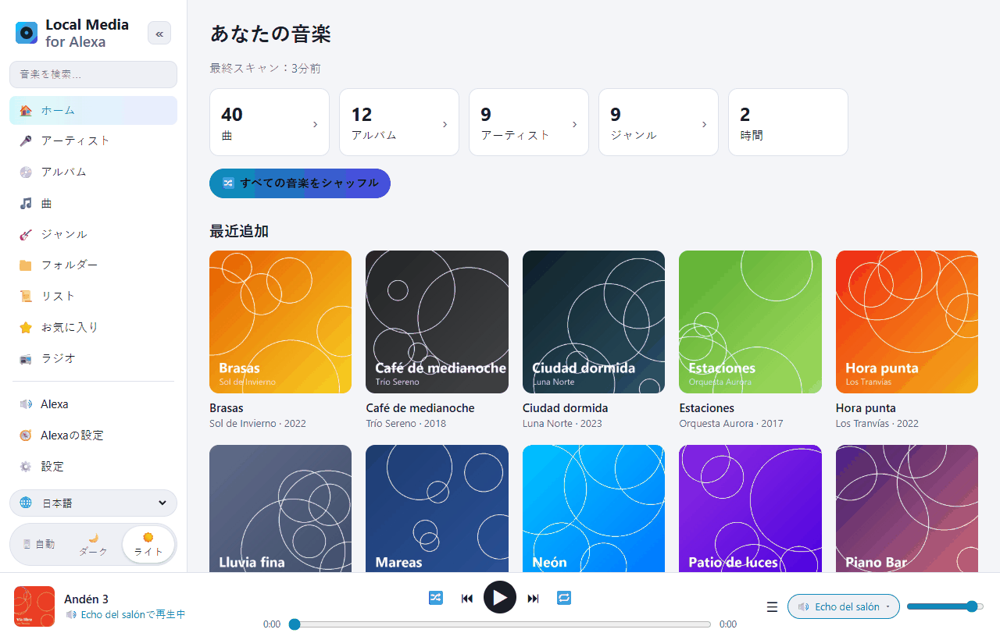
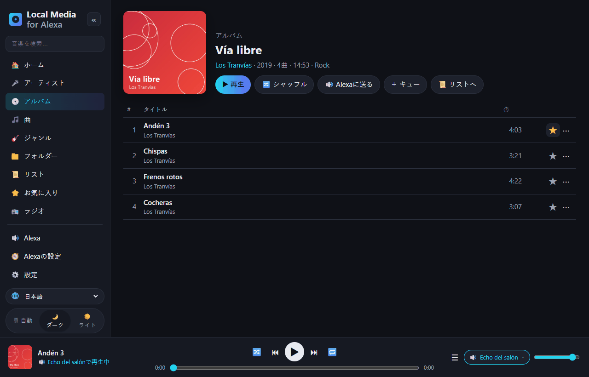
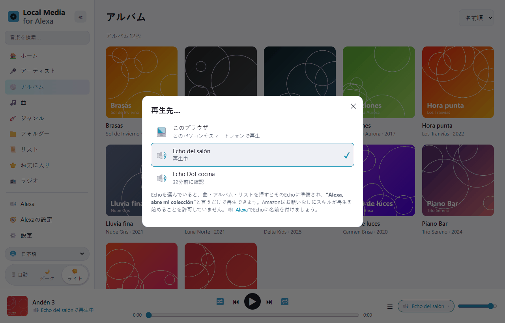
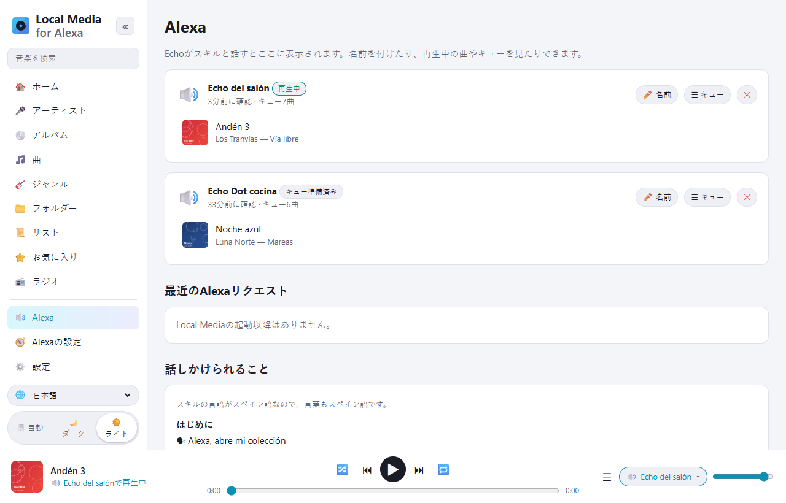
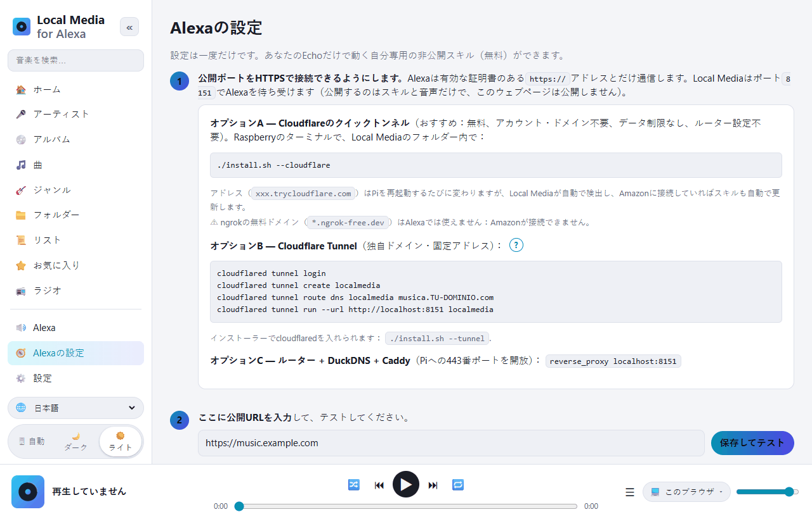

# Local Media for Alexa — Raspberry Pi の音楽を Alexa で

[Español](README.md) · [English](README.en.md) · [Português](README.pt.md) · [Français](README.fr.md) · [Deutsch](README.de.md) · [Italiano](README.it.md) · [Polski](README.pl.md) · [Русский](README.ru.md) · [한국어](README.ko.md) · **日本語**

**Raspberry Pi / ARM Linux** 向けの、*My Media for Alexa* の無料・セルフホスト型の代替アプリです
（x86 の Linux や Docker でも動きます）。
USB ドライブ、SD カード、マウントした NAS、DLNA サーバーの音楽をスキャンし、
Echo で声で再生します。すべて自宅の中で完結し、中継サーバーや外部アカウントは不要です。



Alexa スキルは **スペイン語**（スペイン、メキシコ、米国）と **英語**（米国、英国）に対応しています。
話しかける言葉はスキルの言語で言います：

```
"Alexa, open my collection"
"Alexa, ask my collection to play Queen"
"Alexa, ask my collection to play the album Abbey Road"
"Alexa, next" · "Alexa, shuffle" · "Alexa, ask my collection what's playing"
```

スペイン語では：*“Alexa, abre mi colección”*、*“Alexa, pide a mi colección que ponga Queen”*…

## ウェブ画面の紹介

管理用のウェブは、自宅のスマートフォンやパソコンから開きます（`http://PiのIP:8080`）。
10 言語に翻訳されており（左下の 🌐 で選択）、ライトとダークのテーマがあります。

| | |
|---|---|
|  |  |
| **ライブラリを見る**：アーティスト、アルバム、曲、ジャンル、フォルダー、リスト、ラジオ別に表示。各曲にお気に入り ⭐ と ⋯ メニュー（次に再生、キューに追加、リストに追加…）があります。 | **再生先…**：ブラウザで再生するか、選んだ Echo にキューを準備します。あとは *“Alexa, open my collection”* と言うだけです。 |
|  |  |
| **Alexa**：あなたの Echo、それぞれの再生中の曲とキュー。名前を付けられます。下には話しかけられる言葉の一覧があります。 | **Alexa の設定**：手順ごとのガイド。*Amazon に接続* ボタンでスキルが自動で作られます。 |

## Raspberry Pi へのインストール

必要なもの：Raspberry Pi OS（Bookworm 以降）を入れた Raspberry Pi 3/4/5 または Zero 2 W。

```bash
sudo apt update && sudo apt install -y git
git clone https://github.com/DivolandiaLabs/Local-Media-for-Alexa.git
cd Local-Media-for-Alexa
chmod +x install.sh
./install.sh --cloudflare
```

インストーラーのオプション：

```bash
./install.sh --music /media/pi/USB/Music    # 音楽フォルダーをすぐに追加
./install.sh --cloudflare                   # Cloudflare クイックトンネル：Alexa 用の無料 HTTPS（おすすめ）
./install.sh --tunnel                       # cloudflared だけをインストール（独自ドメインのトンネル）
```

スマートフォンやパソコンで `http://PiのIP:8080` を開きます：

1. **設定** → フォルダーを追加 → **今すぐスキャン**。
2. **Alexa の設定** → 手順ごとのガイド（約 10 分、一度だけ）。

最新版へのアップデート：

```bash
cd ~/Local-Media-for-Alexa && git pull && ./install.sh
```

そのあと **Alexa の設定** で **🗣 音声モデルを更新** を押すと、スキルに新しい言葉が反映されます。

Docker の場合：[Dockerfile](Dockerfile) の冒頭の説明を参照してください。

### 古い Raspberry Pi OS（Bullseye / Buster）

`cat /etc/os-release` でバージョンを確認してください。Raspberry Pi OS **Bullseye**（Debian 11）と
**Buster**（Debian 10）はサポートが終了し、Debian は通常のサーバーからそのパッケージを
削除しているため、`apt` が `404 Not Found` エラーになります。Local Media 自体は動きますが
（必要なのは Python 3.7+ だけ）、`apt` で `python3-venv` と `ffmpeg` をインストールできる必要があります。

**おすすめ：** [Raspberry Pi Imager](https://www.raspberrypi.com/software/) で
最新の Raspberry Pi OS（64 ビット）を新しいカードに書き込んでください。セキュリティ更新を
受け続けられるのはこれだけです。

**手早い方法（Bullseye のまま使う）：** `sudo apt update` が Debian のリポジトリで
エラーになる場合は、アーカイブに向けてから再実行します：

```bash
sudo cp /etc/apt/sources.list /etc/apt/sources.list.bak
echo "deb http://archive.debian.org/debian bullseye main contrib non-free" | sudo tee /etc/apt/sources.list
echo "deb http://archive.debian.org/debian-security bullseye-security main contrib non-free" | sudo tee -a /etc/apt/sources.list
sudo apt update
cd ~/Local-Media-for-Alexa && ./install.sh
```

（元に戻すには：`sudo cp /etc/apt/sources.list.bak /etc/apt/sources.list`）

## 機能

| My Media for Alexa | Local Media |
|---|---|
| アーティスト、アルバム、曲、ジャンル、リストで再生 | ✅ あいまい検索（Alexa の聞き間違いにも対応） |
| フォルダーで再生 | ✅ |
| 年 / 年代別 | ✅ 「1995 年の音楽」「90 年代」 |
| ライブラリ全体をシャッフル | ✅ |
| 最近追加 / よく聴く曲 / お気に入り | ✅ |
| 「このアーティストをもっと」「このアルバムをかけて」 | ✅ |
| 次へ、前へ、一時停止、再開、最初から | ✅ |
| シャッフルとリピート | ✅ |
| Echo のボタンと Alexa アプリの操作 | ✅ |
| 「今何がかかってる？」 | ✅ |
| Echo Show / Spot / アプリでのジャケットと曲名 | ✅（フォルダーの cover.jpg か埋め込みジャケット） |
| M3U / M3U8 / PLS リスト | ✅ スキャン時に自動で取り込み |
| iTunes のプレイリスト | ✅ 書き出した `iTunes Library.xml` / `Library.xml` を読み込み（ファイル › ライブラリ › 書き出す） |
| アルバム、アーティスト、プレイリスト、ジャンルをシャッフル | ✅ |
| 自分の言葉でモード切替（"turn on loop mode"、"turn off shuffle"…） | ✅ |
| 「この曲をプレイリスト X に追加」 | ✅（なければ作成） |
| 「この曲はもうかけないで」/「この曲を忘れて」 | ✅ 無視リスト、設定で元に戻せる |
| インターネットラジオ / ストリーム（「放送局 X をかけて」） | ✅ ウェブの 📻 ラジオと、http アドレス入りの .m3u/.pls |
| オーディオブック（「X を読んで」） | ✅ 続きの位置を記憶 |
| My Media の言い方："Alexa, open my collection and play …" | ✅ |
| 自作リスト | ✅ ウェブで作成・編集、M3U に書き出し可能 |
| FLAC、WMA、OGG、OPUS、WAV、ALAC、APE… | ✅ ffmpeg でその場で MP3 に変換（シーク／再開対応） |
| UPnP / DLNA サーバー（NAS、Plex、Jellyfin、MiniDLNA…） | ✅ |
| 複数の Echo、それぞれ別のキュー | ✅ |
| Alexa のマルチルームグループ | ✅（Alexa が管理） |
| ライブラリを見るためのウェブ | ✅ + ブラウザプレーヤー、ダークモード、10 言語 |
| ウェブでキューを準備して Echo に送る | ✅ 「再生先…」で選択 |
| 自動再スキャン | ✅ 差分のみ、N 分ごと |
| リモートアクセス | ✅ Cloudflare Tunnel / Caddy（外部の中継サーバーなし） |
| スキル（音声）の言語 | ✅ es-ES、es-MX、es-US、en-US、en-GB |

## 全体のしくみ

```
Echo ──音声──▶ Amazon ──HTTPS──▶ トンネル (Cloudflare) ──▶ Pi :8765  /alexa   (スキル)
Echo ◀──────────────── HTTPS で音声 ────────────────────── Pi :8765  /s/<秘密鍵>/…
あなた (スマホ/PC、自宅) ─────────────────────────────────▶ Pi :8080  管理ウェブ
```

* インターネットに公開するのは **ポート 8765** だけです：Alexa にだけ応答し（Amazon の署名を確認）、
  ランダムな秘密鍵の裏で音声とジャケットを配信します。
* **ポート 8080**（ウェブ）は自宅のネットワーク内にとどまります。パスワードも設定できます。
* Alexa は有効な証明書のある HTTPS を必須とするため、トンネルかプロキシが必要です。
  いちばん簡単なのは Cloudflare クイックトンネル（`./install.sh --cloudflare`）です：
  無料で、アカウントもドメインも不要。再起動でアドレスが変わりますが、Local Media が
  検出してスキルを自動で更新します。

## Alexa スキル

**開発モードの非公開スキル**です：公開されず、無料で、あなたのアカウントのすべての
Echo で使えます。Local Media は、Alexa が聞き取りやすいよう **ライブラリ内の名前を使って**
音声モデルを作ります。[skill/](skill) には汎用モデルと
`skill.json` マニフェスト（`ask-cli` 用）もあります。

### Amazon に接続（自動）

**Alexa の設定** に **AMAZON に接続** ボタンがあります：Amazon アカウントでログインすると、
Local Media がスキルを自動で作成します（ライブラリ入りの音声モデル、オーディオプレーヤー、
アドレス、Echo での有効化）。その後は、スキャンでライブラリが変わるたびに
音声モデルをアップロードし直します。

その前に一度だけ、Amazon は **Login with Amazon のセキュリティプロファイル** の作成を求めます
（各欄に何を貼り付けるかはウェブが教えてくれます）：

1. [Login with Amazon](https://developer.amazon.com/loginwithamazon/console/site/lwa/overview.html)
   → *Create a New Security Profile* → 名前、説明、*Consent Privacy Notice URL* に
   `https://あなたの公開URL/privacidad`。
2. *Web Settings* → *Allowed Return URLs*：`https://あなたの公開URL/amazon/callback`。
3. *Client ID* と *Client Secret* を Local Media にコピーします。

シークレットと Amazon の許可はあなたの Pi にだけ保存され（`~/.localmedia/config.json`、
権限 600）、ウェブに表示されることはありません。*接続を解除* すると削除されますが、スキルは
そのまま使えます。

呼び出し名：**"my collection"**（スペイン語では *"mi colección"*）。Alexa コンソール（*Invocation*）で
変更でき、Local Media はこの名前に依存しません。

Alexa のスキルは自分から再生を始められません：ウェブで Echo にキューを準備したら、
*"Alexa, open my collection"* と言って再生を始めてください。

## 言語

* **ウェブ：** スペイン語、英語、ポルトガル語、フランス語、ドイツ語、イタリア語、ポーランド語、ロシア語、韓国語、日本語。
  🌐 メニューで選びます（初期値はブラウザの言語）。
* **音声（Alexa スキル）：** スペイン語（スペイン、メキシコ、米国）と英語（米国、英国）。

## よくある問題

| 症状 | 対処 |
|---|---|
| 「リクエストされたスキルの応答に問題があります」 | `journalctl -u localmedia -f` を確認してください。リクエストが古すぎると出る場合は Pi の時刻がずれています（`timedatectl`）。 |
| Alexa は答えるが再生されない | 公開 URL に HTTPS で接続できないか、有効な証明書がありません。ガイドの *保存してテスト* ボタンを使ってください。 |
| ngrok を使っていて Alexa が接続できない | ngrok の無料ドメインは Alexa では使えません。`./install.sh --cloudflare` を使ってください。 |
| FLAC が再生されない | ffmpeg がありません：`sudo apt install ffmpeg`。 |
| Alexa が珍しい名前を聞き取れない | *Alexa の設定* で **🗣 音声モデルを更新** を押してください（ライブラリが含まれます）。 |
| NAS の曲が表示されない | 共有フォルダーをマウント（`/etc/fstab`、CIFS/NFS）して追加するか、設定で UPnP/DLNA を有効にしてください。 |

便利なコマンド：

```bash
journalctl -u localmedia -f          # 動作状況を見る
sudo systemctl restart localmedia    # 再起動
./uninstall.sh                       # サービスを削除（音楽は消えません）
```

## ファイル構成

```
localmedia/          プログラム本体（Python 3.9+）
  alexa.py           インテント、デバイスごとのキュー、AudioPlayer イベント
  alexa_verify.py    Amazon の署名と証明書の確認
  amazon.py          Login with Amazon とスキルの自動作成
  tunnel.py          Cloudflare クイックトンネルのアドレスを追跡
  library.py         スキャン、タグ（mutagen）、ジャケット、リスト、検索
  media.py           シーク対応の音声配信と ffmpeg 変換
  upnp.py            UPnP/DLNA クライアント
  skillmodel.py      スキルの音声モデルを生成
  web.py             公開サーバー（Alexa）と管理ウェブ
  static/            ウェブ（static/i18n/ = 翻訳）
skill/               汎用の音声モデルとスキルのマニフェスト
docs/screenshots/    この README のスクリーンショット
install.sh           Raspberry Pi OS / Debian 用インストーラー
```

データ（設定、データベース、ジャケットのキャッシュ）：`~/.localmedia/`。
