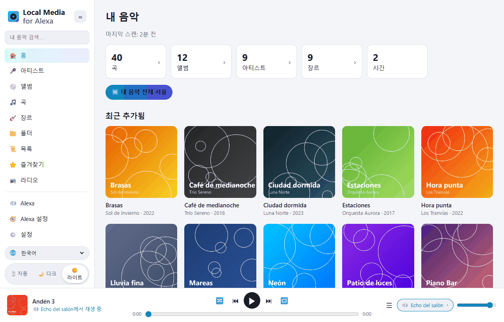
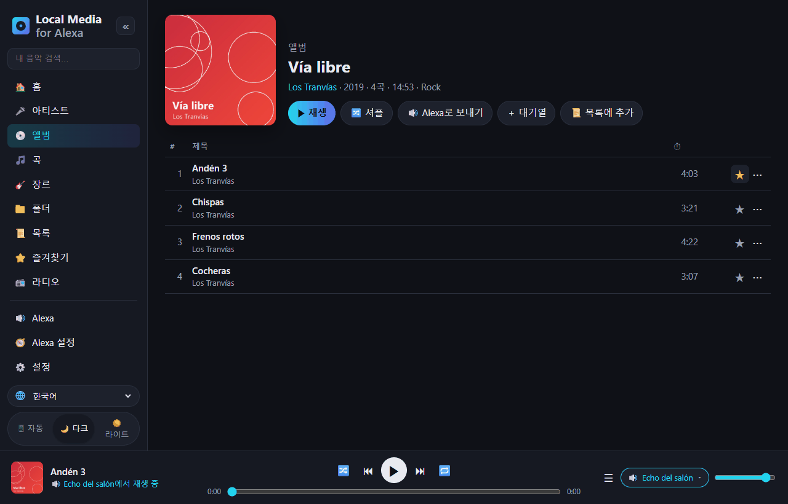
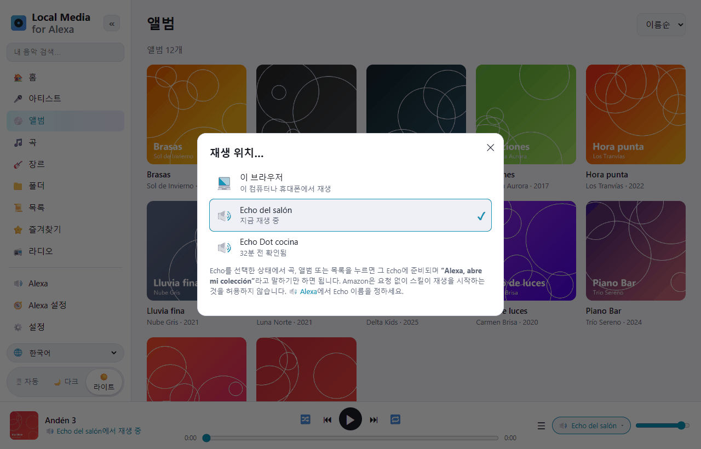
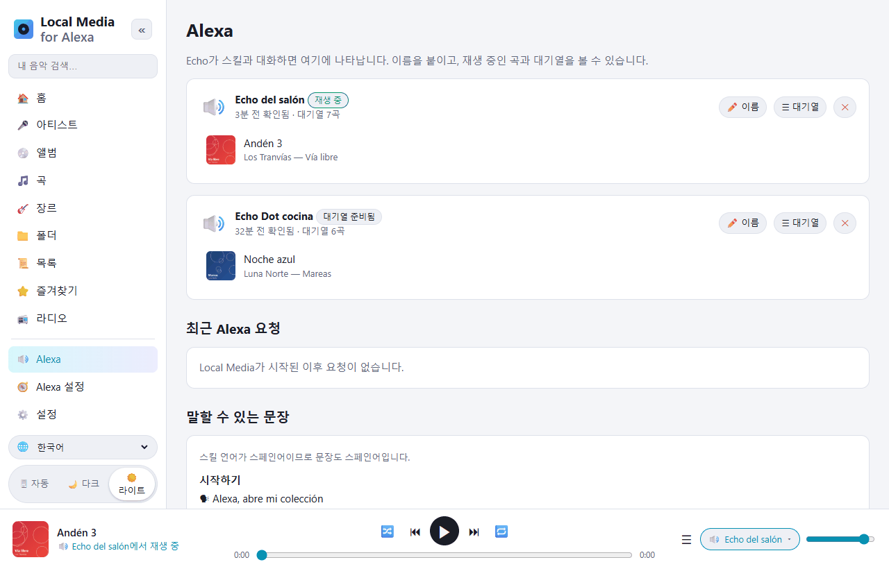
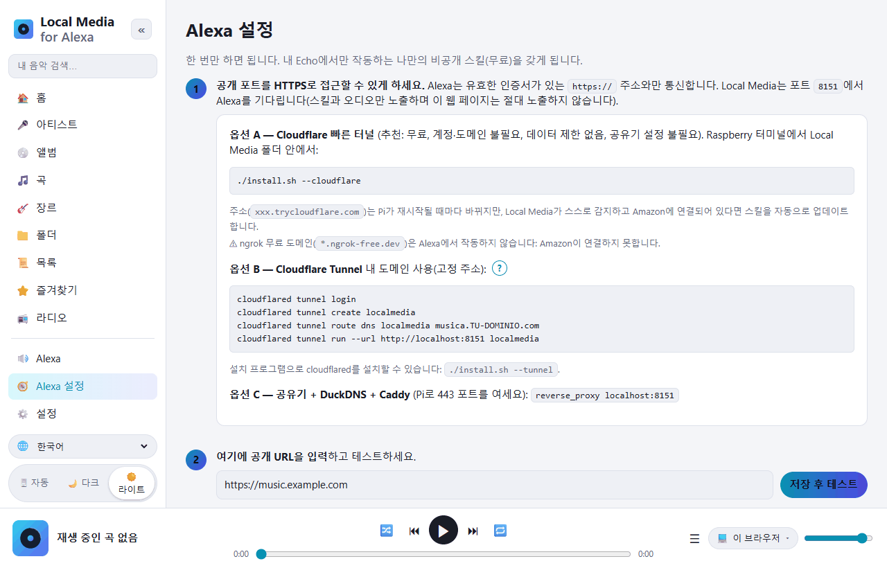

# Local Media for Alexa — 라즈베리 파이의 음악을 Alexa로

[Español](README.md) · [English](README.en.md) · [Português](README.pt.md) · [Français](README.fr.md) · [Deutsch](README.de.md) · [Italiano](README.it.md) · [Polski](README.pl.md) · [Русский](README.ru.md) · **한국어** · [日本語](README.ja.md)

**라즈베리 파이 / ARM 리눅스**용 *My Media for Alexa*의 무료 자체 호스팅 대안입니다
(x86 리눅스나 Docker에서도 작동합니다).
USB 드라이브, SD 카드, 마운트한 NAS, DLNA 서버의 음악을 스캔해서
음성으로 Echo에서 재생합니다. 모든 것이 집 안에 머뭅니다: 중계 서버도, 외부 계정도 없습니다.



Alexa 스킬은 **스페인어**(스페인, 멕시코, 미국)와 **영어**(미국, 영국)로 작동합니다.
Alexa는 한국어 커스텀 스킬을 지원하지 않습니다. 문장은 스킬의 언어로 말합니다:

```
"Alexa, open my collection"
"Alexa, ask my collection to play Queen"
"Alexa, ask my collection to play the album Abbey Road"
"Alexa, next" · "Alexa, shuffle" · "Alexa, ask my collection what's playing"
```

스페인어: *“Alexa, abre mi colección”*, *“Alexa, pide a mi colección que ponga Queen”*…

## 웹 화면 둘러보기

관리 웹은 집에 있는 휴대폰이나 컴퓨터에서 엽니다(`http://파이-IP:8080`).
10개 언어로 번역되어 있고(왼쪽 아래 🌐 선택), 라이트·다크 테마가 있습니다.

| | |
|---|---|
|  |  |
| **라이브러리 탐색**: 아티스트, 앨범, 곡, 장르, 폴더, 목록, 라디오별로 볼 수 있습니다. 곡마다 즐겨찾기 ⭐와 ⋯ 메뉴(다음에 재생, 대기열에 추가, 목록에 추가…)가 있습니다. | **재생 위치…**: 브라우저에서 재생하거나, 선택한 Echo에 대기열을 준비합니다. 그다음 *“Alexa, open my collection”*이라고 말하면 됩니다. |
|  |  |
| **Alexa**: 내 Echo 기기, 각각 재생 중인 곡과 대기열. 이름을 붙일 수 있습니다. 아래에는 말할 수 있는 모든 문장이 있습니다. | **Alexa 설정**: 단계별 안내. *Amazon에 연결* 버튼을 누르면 스킬이 자동으로 만들어집니다. |

## 라즈베리 파이에 설치

요구 사항: Raspberry Pi OS(Bookworm 이상)가 설치된 Raspberry Pi 3/4/5 또는 Zero 2 W.

```bash
sudo apt update && sudo apt install -y git
git clone https://github.com/DivolandiaLabs/Local-Media-for-Alexa.git
cd Local-Media-for-Alexa
chmod +x install.sh
./install.sh --cloudflare
```

설치 프로그램 옵션:

```bash
./install.sh --music /media/pi/USB/Music    # 음악 폴더를 바로 추가
./install.sh --cloudflare                   # Cloudflare 빠른 터널: Alexa용 무료 HTTPS (추천)
./install.sh --tunnel                       # cloudflared만 설치 (내 도메인 터널)
```

휴대폰이나 컴퓨터에서 `http://파이-IP:8080`을 엽니다:

1. **설정** → 폴더 추가 → **지금 스캔**.
2. **Alexa 설정** → 단계별 안내(약 10분, 한 번만).

최신 버전으로 업데이트:

```bash
cd ~/Local-Media-for-Alexa && git pull && ./install.sh
```

그다음 **Alexa 설정**에서 **🗣 음성 모델 업데이트**를 눌러 스킬이 새 문장을 받게 하세요.

Docker 사용 시: [Dockerfile](Dockerfile) 맨 위의 안내를 보세요.

### 오래된 Raspberry Pi OS (Bullseye / Buster)

`cat /etc/os-release`로 버전을 확인하세요. Raspberry Pi OS **Bullseye**(Debian 11)와
**Buster**(Debian 10)는 더 이상 지원되지 않으며, Debian은 일반 서버에서 해당 패키지를
제거하고 있어 `apt`가 `404 Not Found` 오류를 냅니다. Local Media는 여기서도 작동하지만
(Python 3.7+만 필요), `apt`로 `python3-venv`와 `ffmpeg`를 설치할 수 있어야 합니다.

**추천:** [Raspberry Pi Imager](https://www.raspberrypi.com/software/)로
최신 Raspberry Pi OS(64비트)를 새 카드에 설치하세요. 보안 업데이트를 계속 받는 것은
이것뿐입니다.

**빠른 방법(Bullseye 유지):** `sudo apt update`가 Debian 저장소 오류를 내면
아카이브로 바꾼 뒤 다시 시도하세요:

```bash
sudo cp /etc/apt/sources.list /etc/apt/sources.list.bak
echo "deb http://archive.debian.org/debian bullseye main contrib non-free" | sudo tee /etc/apt/sources.list
echo "deb http://archive.debian.org/debian-security bullseye-security main contrib non-free" | sudo tee -a /etc/apt/sources.list
sudo apt update
cd ~/Local-Media-for-Alexa && ./install.sh
```

(되돌리기: `sudo cp /etc/apt/sources.list.bak /etc/apt/sources.list`.)

## 기능

| My Media for Alexa | Local Media |
|---|---|
| 아티스트, 앨범, 곡, 장르, 목록으로 재생 | ✅ 유사 검색 (Alexa가 잘못 들어도 찾아냄) |
| 폴더로 재생 | ✅ |
| 연도 / 연대별 | ✅ "1995년 음악", "90년대" |
| 전체 라이브러리 셔플 | ✅ |
| 최근 추가 / 많이 들은 곡 / 즐겨찾기 | ✅ |
| "이 아티스트 더 듣기", "이 앨범 틀어줘" | ✅ |
| 다음, 이전, 일시정지, 계속, 처음부터 | ✅ |
| 셔플과 반복 | ✅ |
| Echo 버튼과 Alexa 앱 조작 | ✅ |
| "지금 뭐 나와?" | ✅ |
| Echo Show / Spot / 앱의 앨범 아트와 제목 | ✅ (폴더의 cover.jpg 또는 내장 아트) |
| M3U / M3U8 / PLS 목록 | ✅ 스캔할 때 자동으로 가져옴 |
| iTunes 플레이리스트 | ✅ 내보낸 `iTunes Library.xml` / `Library.xml`을 읽음 (파일 › 보관함 › 내보내기) |
| 앨범, 아티스트, 플레이리스트, 장르 셔플 | ✅ |
| 원하는 말로 모드 전환 ("turn on loop mode", "turn off shuffle"…) | ✅ |
| "이 곡을 내 플레이리스트 X에 추가" | ✅ (없으면 만듦) |
| "이 곡 다시 틀지 마" / "이 곡 잊어" | ✅ 무시 목록, 설정에서 복원 가능 |
| 인터넷 라디오 / 스트림 ("X 방송국 틀어줘") | ✅ 웹의 📻 라디오 메뉴와 http 주소가 담긴 .m3u/.pls |
| 오디오북 ("X 읽어줘") | ✅ 마지막 위치를 기억 |
| My Media 문장 형식: "Alexa, open my collection and play …" | ✅ |
| 직접 만든 목록 | ✅ 웹에서 만들고 편집, M3U로 내보내기 |
| FLAC, WMA, OGG, OPUS, WAV, ALAC, APE… | ✅ ffmpeg로 실시간 MP3 변환 (탐색/이어듣기 지원) |
| UPnP / DLNA 서버 (NAS, Plex, Jellyfin, MiniDLNA…) | ✅ |
| 여러 Echo, 각각 별도의 대기열 | ✅ |
| Alexa 멀티룸 그룹 | ✅ (Alexa가 관리) |
| 라이브러리를 탐색하는 웹 | ✅ + 브라우저 플레이어, 다크 모드, 10개 언어 |
| 웹에서 대기열을 준비해 Echo로 보내기 | ✅ "재생 위치…" 선택 |
| 자동 다시 스캔 | ✅ 증분 방식, N분마다 |
| 원격 접속 | ✅ Cloudflare Tunnel / Caddy (외부 중계 서버 없음) |
| 스킬(음성) 언어 | ✅ es-ES, es-MX, es-US, en-US, en-GB |

## 전체 구조

```
Echo ──음성──▶ Amazon ──HTTPS──▶ 터널 (Cloudflare) ──▶ Pi :8765  /alexa   (스킬)
Echo ◀──────────────── HTTPS 오디오 ────────────────── Pi :8765  /s/<비밀키>/…
나 (휴대폰/PC, 집) ───────────────────────────────────▶ Pi :8080  관리 웹
```

* **포트 8765**만 인터넷에 노출됩니다: Alexa에만 응답하며(Amazon 서명 확인),
  무작위 비밀 키 뒤에서 오디오와 앨범 아트를 제공합니다.
* **포트 8080**(웹)은 집 네트워크 안에 머뭅니다. 비밀번호를 걸 수 있습니다.
* Alexa는 유효한 인증서가 있는 HTTPS를 요구하므로 터널이나 프록시가 필요합니다.
  가장 쉬운 방법은 Cloudflare 빠른 터널(`./install.sh --cloudflare`)입니다:
  무료이고 계정도 도메인도 필요 없습니다. 재시작하면 주소가 바뀌지만 Local Media가
  감지해서 스킬을 자동으로 업데이트합니다.

## Alexa 스킬

**개발 모드의 비공개 스킬**입니다: 게시되지 않고, 무료이며, 내 계정의 모든
Echo에서 작동합니다. Local Media는 Alexa가 더 잘 알아듣도록 **내 라이브러리의 이름으로**
음성 모델을 만듭니다. [skill/](skill)에는 일반 모델과
`skill.json` 매니페스트(`ask-cli`용)도 있습니다.

### Amazon에 연결 (자동)

**Alexa 설정**에 **AMAZON에 연결** 버튼이 있습니다: Amazon 계정으로 로그인하면
Local Media가 스킬을 직접 만듭니다(내 라이브러리가 담긴 음성 모델, 오디오 플레이어,
주소, Echo에서 활성화). 그 뒤로는 스캔으로 라이브러리가 바뀔 때마다
음성 모델을 다시 업로드합니다.

그 전에 딱 한 번, Amazon은 **Login with Amazon 보안 프로필**을 만들라고 요구합니다
(각 칸에 무엇을 붙여넣을지 웹이 알려줍니다):

1. [Login with Amazon](https://developer.amazon.com/loginwithamazon/console/site/lwa/overview.html)
   → *Create a New Security Profile* → 이름, 설명, *Consent Privacy Notice URL*에
   `https://내-공개-URL/privacidad`.
2. *Web Settings* → *Allowed Return URLs*: `https://내-공개-URL/amazon/callback`.
3. *Client ID*와 *Client Secret*을 Local Media에 복사합니다.

비밀 값과 Amazon 권한은 내 Pi에만 저장되며(`~/.localmedia/config.json`,
권한 600) 웹에는 절대 표시되지 않습니다. *연결 해제*를 누르면 삭제되며, 스킬은 계속
작동합니다.

호출 이름: **"my collection"**(스페인어 *"mi colección"*). Alexa 콘솔(*Invocation*)에서
바꿀 수 있으며 Local Media는 이 이름에 의존하지 않습니다.

Alexa 스킬은 스스로 재생을 시작할 수 없습니다: 웹에서 Echo에 대기열을 준비했다면
*"Alexa, open my collection"*이라고 말해 시작하세요.

## 언어

* **웹:** 스페인어, 영어, 포르투갈어, 프랑스어, 독일어, 이탈리아어, 폴란드어, 러시아어, 한국어, 일본어.
  🌐 선택 메뉴에서 고릅니다(기본값은 브라우저 언어).
* **음성(Alexa 스킬):** 스페인어(스페인, 멕시코, 미국)와 영어(미국, 영국).

## 자주 묻는 문제

| 증상 | 해결 |
|---|---|
| "요청한 스킬의 응답에 문제가 있습니다" | `journalctl -u localmedia -f`를 확인하세요. 요청이 너무 오래됐다고 나오면 Pi의 시간이 틀렸습니다(`timedatectl`). |
| Alexa가 대답하지만 재생되지 않음 | 공개 URL이 HTTPS로 접근되지 않거나 유효한 인증서가 없습니다. 안내의 *저장 후 테스트* 버튼을 사용하세요. |
| ngrok을 쓰는데 Alexa가 연결되지 않음 | ngrok 무료 도메인은 Alexa에서 작동하지 않습니다. `./install.sh --cloudflare`를 사용하세요. |
| FLAC이 재생되지 않음 | ffmpeg가 없습니다: `sudo apt install ffmpeg`. |
| Alexa가 특이한 이름을 못 알아들음 | *Alexa 설정*에서 **🗣 음성 모델 업데이트**를 누르세요(내 라이브러리가 포함됨). |
| NAS의 곡이 보이지 않음 | 공유 폴더를 마운트(`/etc/fstab`, CIFS/NFS)해서 추가하거나 설정에서 UPnP/DLNA를 켜세요. |

유용한 명령:

```bash
journalctl -u localmedia -f          # 무슨 일이 일어나는지 보기
sudo systemctl restart localmedia    # 다시 시작
./uninstall.sh                       # 서비스 제거 (음악은 지워지지 않음)
```

## 파일

```
localmedia/          프로그램 (Python 3.9+)
  alexa.py           인텐트, 기기별 대기열, AudioPlayer 이벤트
  alexa_verify.py    Amazon 서명과 인증서 확인
  amazon.py          Login with Amazon과 스킬 자동 생성
  tunnel.py          Cloudflare 빠른 터널 주소 추적
  library.py         스캔, 태그(mutagen), 앨범 아트, 목록, 검색
  media.py           탐색 가능한 오디오 전송과 ffmpeg 변환
  upnp.py            UPnP/DLNA 클라이언트
  skillmodel.py      스킬 음성 모델 생성
  web.py             공개 서버(Alexa)와 관리 웹
  static/            웹 (static/i18n/ = 번역)
skill/               일반 음성 모델과 스킬 매니페스트
docs/screenshots/    이 README의 스크린샷
install.sh           Raspberry Pi OS / Debian용 설치 프로그램
```

데이터(설정, 데이터베이스, 앨범 아트 캐시): `~/.localmedia/`.
