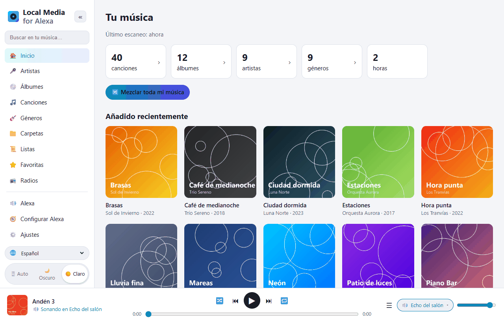
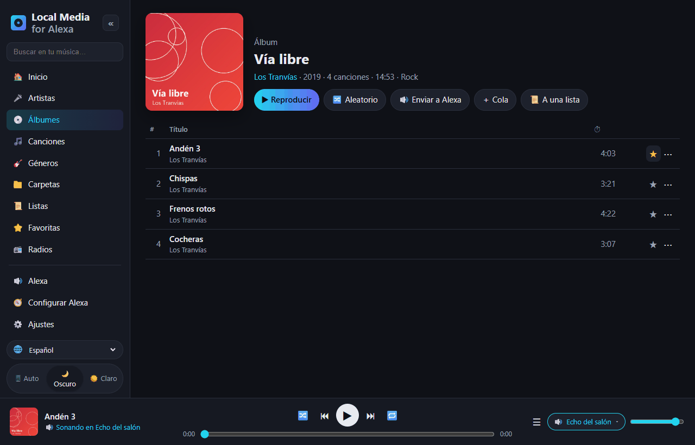
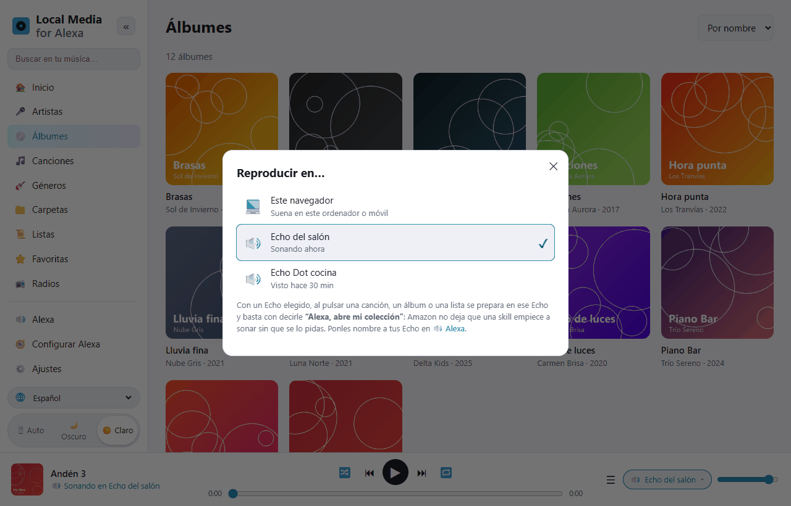
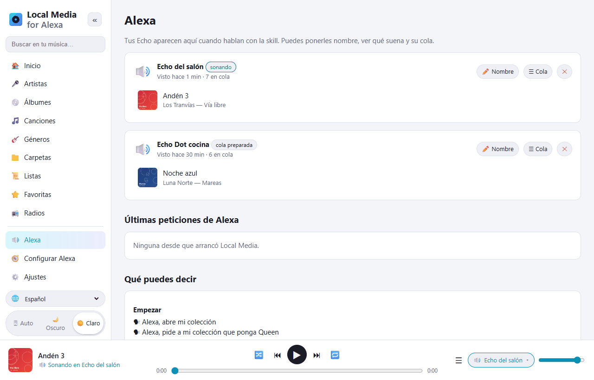
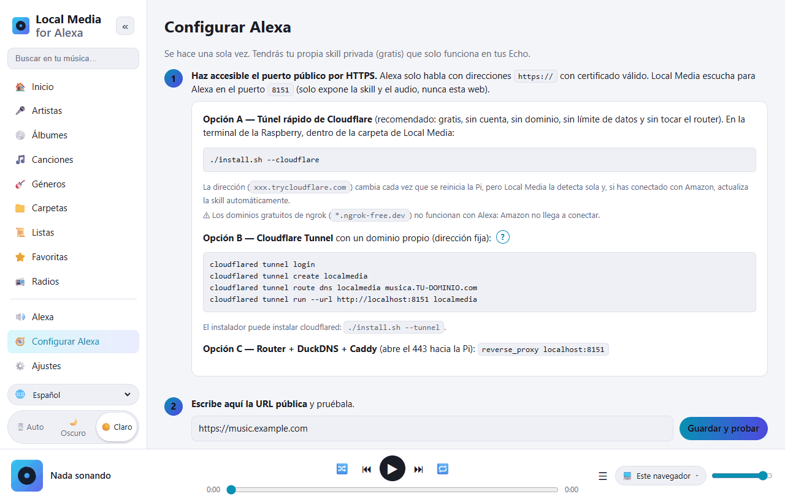

# Local Media for Alexa — tu música de la Raspberry Pi en Alexa

**Español** · [English](README.en.md) · [Português](README.pt.md) · [Français](README.fr.md) · [Deutsch](README.de.md) · [Italiano](README.it.md) · [Polski](README.pl.md) · [Русский](README.ru.md) · [한국어](README.ko.md) · [日本語](README.ja.md)

Alternativa libre y autoalojada a *My Media for Alexa* para **Raspberry Pi / Linux ARM**
(funciona también en cualquier Linux x86 o con Docker).
Escanea tu música (disco USB, tarjeta SD, NAS montado o servidores DLNA) y la reproduce
en tus Echo con la voz. Todo se queda en tu casa: no hay servidores intermedios ni cuentas de terceros.



```
"Alexa, abre mi colección"
"Alexa, pide a mi colección que ponga Queen"
"Alexa, pide a mi colección que ponga el disco Abbey Road"
"Alexa, abre mi colección reproduzca la pista Bohemian Rhapsody"
"Alexa, pide a mi colección que ponga música de los ochenta"
"Alexa, siguiente" · "Alexa, aleatorio" · "Alexa, pide a mi colección qué está sonando"
```

## Un vistazo a la web

La web de gestión se abre desde el móvil o el PC de casa (`http://IP-DE-LA-PI:8080`).
Está traducida a 10 idiomas (selector 🌐 abajo a la izquierda) y tiene modo claro y oscuro.

| | |
|---|---|
|  |  |
| **Explora tu biblioteca** por artistas, álbumes, canciones, géneros, carpetas, listas y radios. Cada pista tiene favorita ⭐ y menú ⋯ (siguiente, a la cola, a una lista…). | **Reproducir en…**: suena en el navegador o se prepara en el Echo que elijas. Luego basta con decir *“Alexa, abre mi colección”*. |
|  |  |
| **Alexa**: tus Echo, qué suena en cada uno y su cola. Ponles nombre. Debajo, todas las frases que puedes decir. | **Configurar Alexa**: guía paso a paso. Con el botón *Conectar con Amazon* la skill se crea sola. |

## Instalación en la Raspberry Pi

Requisitos: Raspberry Pi 3/4/5 o Zero 2 W con Raspberry Pi OS (Bookworm o posterior).

```bash
sudo apt update && sudo apt install -y git
git clone https://github.com/DivolandiaLabs/Local-Media-for-Alexa.git
cd Local-Media-for-Alexa
chmod +x install.sh
./install.sh --cloudflare
```

Opciones del instalador:

```bash
./install.sh --music /media/pi/USB/Musica   # añade ya una carpeta de música
./install.sh --cloudflare                   # túnel rápido de Cloudflare: HTTPS gratis para Alexa (recomendado)
./install.sh --tunnel                       # solo instala cloudflared (túnel con dominio propio)
```

Abre `http://IP-DE-LA-PI:8080` desde el móvil o el PC:

1. **Ajustes** → añade carpetas → **Escanear ahora**.
2. **Configurar Alexa** → guía paso a paso (unos 10 minutos, solo una vez).

Actualizar a la última versión:

```bash
cd ~/Local-Media-for-Alexa && git pull && ./install.sh
```

Después, en **Configurar Alexa**, pulsa **🗣 Actualizar modelo de voz** para que la skill reciba las frases nuevas.

Con Docker: mira las instrucciones al principio del [Dockerfile](Dockerfile).

### Raspberry Pi OS antiguo (Bullseye / Buster)

Mira tu versión con `cat /etc/os-release`. Raspberry Pi OS **Bullseye** (Debian 11) y
**Buster** (Debian 10) ya no reciben soporte, y Debian va retirando sus paquetes de los
servidores normales: `apt` da errores `404 Not Found`. Local Media funciona en ellas
(solo necesita Python 3.7+), pero hay que conseguir que `apt` instale `python3-venv` y `ffmpeg`.

**Opción recomendada:** grabar una tarjeta nueva con Raspberry Pi OS actual (64 bits)
usando [Raspberry Pi Imager](https://www.raspberrypi.com/software/). Es la única que
seguirá recibiendo actualizaciones de seguridad.

**Opción rápida (seguir con Bullseye):** si `sudo apt update` se queja de los
repositorios de Debian, apúntalos al archivo histórico y vuelve a intentarlo:

```bash
sudo cp /etc/apt/sources.list /etc/apt/sources.list.bak
echo "deb http://archive.debian.org/debian bullseye main contrib non-free" | sudo tee /etc/apt/sources.list
echo "deb http://archive.debian.org/debian-security bullseye-security main contrib non-free" | sudo tee -a /etc/apt/sources.list
sudo apt update
cd ~/Local-Media-for-Alexa && ./install.sh
```

(Para volver atrás: `sudo cp /etc/apt/sources.list.bak /etc/apt/sources.list`.)

## Funciones

| My Media for Alexa | Local Media |
|---|---|
| Reproducir por artista, álbum, canción, género, lista | ✅ con búsqueda aproximada (tolera lo que Alexa oye mal) |
| Reproducir por carpeta | ✅ |
| Por año / década | ✅ "música del 1995", "de los noventa" |
| Toda la biblioteca en aleatorio | ✅ |
| Recién añadido / más escuchado / favoritas | ✅ |
| "Más de este artista", "pon este álbum" | ✅ |
| Siguiente, anterior, pausa, continuar, empezar de nuevo | ✅ |
| Aleatorio y repetición | ✅ |
| Botones del Echo y de la app de Alexa | ✅ |
| "¿Qué está sonando?" | ✅ |
| Carátula y título en Echo Show / Spot / app | ✅ (cover.jpg de la carpeta o la carátula incrustada) |
| Listas M3U / M3U8 / PLS | ✅ importadas solas al escanear |
| Playlists de iTunes | ✅ lee `iTunes Library.xml` / `Library.xml` exportado (Archivo › Biblioteca › Exportar) |
| "Reproduzca aleatoriamente" álbum, artista, playlist o género | ✅ |
| Modos con palabras propias ("active el modo loop", "desactive shuffle"…) | ✅ |
| "Añada esta a mi playlist X" | ✅ (la crea si no existe) |
| "No ponga esta de nuevo" / "olvide esta pista" | ✅ lista de ignoradas recuperable en Ajustes |
| Radios / streams de Internet ("ponga la emisora X") | ✅ apartado 📻 Radios en la web y .m3u/.pls con direcciones http |
| Audiolibros ("lea X") | ✅ recuerda por dónde ibas |
| Forma de frase de My Media: "Alexa, abre mi colección reproduzca …" | ✅ |
| Listas propias | ✅ se crean y editan en la web, exportables a M3U |
| FLAC, WMA, OGG, OPUS, WAV, ALAC, APE… | ✅ conversión al vuelo a MP3 con ffmpeg (con saltos/reanudación) |
| Servidores UPnP / DLNA (NAS, Plex, Jellyfin, MiniDLNA…) | ✅ |
| Varios Echo, cada uno con su cola | ✅ |
| Grupos multisala de Alexa | ✅ (los gestiona Alexa) |
| Web para explorar la biblioteca | ✅ + reproductor en el navegador, modo oscuro, 10 idiomas |
| Preparar una cola en la web y mandarla a un Echo | ✅ selector "Reproducir en…" |
| Reescaneo automático | ✅ incremental, cada N minutos |
| Acceso remoto | ✅ Cloudflare Tunnel / Caddy (sin servidores intermedios de terceros) |
| Idiomas de la skill (voz) | ✅ es-ES, es-MX, es-US, en-US, en-GB |

## Cómo encaja todo

```
Echo ──voz──▶ Amazon ──HTTPS──▶ túnel (Cloudflare) ──▶ Pi :8765  /alexa   (skill)
Echo ◀──────────────── audio HTTPS ─────────────────── Pi :8765  /s/<secreto>/…
Tú (móvil/PC, en casa) ──────────────────────────────▶ Pi :8080  web de gestión
```

* El **puerto 8765** es el único que sale a Internet: solo atiende a Alexa (con la firma
  de Amazon comprobada) y sirve audio y carátulas tras una clave secreta aleatoria.
* El **puerto 8080** (la web) se queda en tu red local. Puedes ponerle contraseña.
* Alexa exige HTTPS con un certificado válido, por eso hace falta un túnel o un proxy.
  La opción más sencilla es el túnel rápido de Cloudflare (`./install.sh --cloudflare`):
  gratis, sin cuenta ni dominio. Su dirección cambia al reiniciar, pero Local Media la
  detecta y actualiza la skill sola.
* Si el túnel rápido se queda colgado (Cloudflare borra su dirección pero el programa sigue en marcha), Local Media lo nota: comprueba la dirección cada 5 minutos y, tras 3 fallos seguidos, reinicia el túnel y pasa la dirección nueva a Amazon. No gasta recursos apreciables.

## La skill de Alexa

Es una skill **privada en modo desarrollo**: no se publica, es gratis y funciona en todos
los Echo de tu cuenta. Local Media genera el modelo de voz **con los nombres de tu biblioteca**
para que Alexa los reconozca mejor. En [skill/](skill) hay también un modelo genérico y
el manifiesto `skill.json` (para `ask-cli`).

### Conectar con Amazon (automático)

En **Configurar Alexa** está el botón **CONECTAR CON AMAZON**: inicias sesión con tu cuenta
de Amazon y Local Media crea la skill solo (modelo de voz con tu biblioteca, reproductor de
audio, dirección y activación en tus Echo). Después vuelve a subir el modelo de voz
cada vez que un escaneo cambia la biblioteca.

Antes, una sola vez, Amazon pide crear un **perfil de seguridad de Login with Amazon**
(la web te dice qué pegar en cada campo):

1. [Login with Amazon](https://developer.amazon.com/loginwithamazon/console/site/lwa/overview.html)
   → *Create a New Security Profile* → nombre, descripción y como *Consent Privacy Notice URL*
   `https://TU-URL-PUBLICA/privacidad`.
2. *Web Settings* → *Allowed Return URLs*: `https://TU-URL-PUBLICA/amazon/callback`.
3. Copia el *Client ID* y el *Client Secret* en Local Media.

El secreto y los permisos de Amazon se guardan solo en tu Pi (`~/.localmedia/config.json`,
permisos 600) y nunca se muestran en la web. *Desconectar* los borra; la skill sigue
funcionando.

Nombre de invocación: **"mi colección"** (en inglés *"my collection"*). Se puede cambiar
en la consola de Alexa (*Invocation*); Local Media no depende de él.

Las skills de Alexa no pueden empezar a sonar por iniciativa propia: cuando preparas una cola
en un Echo desde la web, di *"Alexa, abre mi colección"* para que empiece.

## Idiomas

* **Web:** español, inglés, portugués, francés, alemán, italiano, polaco, ruso, coreano y japonés.
  Se elige con el selector 🌐 (por defecto, el idioma del navegador).
* **Voz (skill de Alexa):** español (España, México, EE. UU.) e inglés (EE. UU., Reino Unido).
  Alexa no ofrece skills propias en coreano, ruso ni polaco.

## Problemas frecuentes

| Síntoma | Solución |
|---|---|
| "Hubo un problema con la respuesta de la skill solicitada" | Revisa `journalctl -u localmedia -f`. Si pone *peticion demasiado antigua*, la hora de la Pi está mal (`timedatectl`). |
| Alexa dice la frase pero no suena | La URL pública no es accesible por HTTPS o no tiene certificado válido. Usa el botón *Guardar y probar* de la guía. |
| Uso ngrok y Alexa no conecta | Los dominios gratuitos de ngrok no funcionan con Alexa. Usa `./install.sh --cloudflare`. |
| No suenan los FLAC | Falta ffmpeg: `sudo apt install ffmpeg`. |
| Alexa no entiende un nombre raro | Pulsa **🗣 Actualizar modelo de voz** en *Configurar Alexa* (lleva tu biblioteca). |
| No aparecen pistas de un NAS | Monta la carpeta compartida (`/etc/fstab`, CIFS/NFS) y añádela, o activa UPnP/DLNA en Ajustes. |

Comandos útiles:

```bash
journalctl -u localmedia -f          # ver lo que pasa
sudo systemctl restart localmedia    # reiniciar
./uninstall.sh                       # quitar el servicio (no borra tu música)
```

## Archivos

```
localmedia/          programa (Python 3.9+)
  alexa.py           intents, colas por dispositivo, eventos del AudioPlayer
  alexa_verify.py    comprobación de firma y certificado de Amazon
  amazon.py          Login with Amazon y creación automática de la skill
  tunnel.py          sigue la dirección del túnel rápido de Cloudflare
  library.py         escaneo, etiquetas (mutagen), carátulas, listas, búsqueda
  media.py           envío de audio con saltos y conversión con ffmpeg
  upnp.py            cliente UPnP/DLNA
  skillmodel.py      genera el modelo de voz de la skill
  web.py             servidor público (Alexa) y web de gestión
  static/            la web (static/i18n/ = traducciones)
skill/               modelo de voz genérico y manifiesto de la skill
docs/screenshots/    capturas de este README
install.sh           instalador para Raspberry Pi OS / Debian
```

Datos (configuración, base de datos, caché de carátulas): `~/.localmedia/`.
