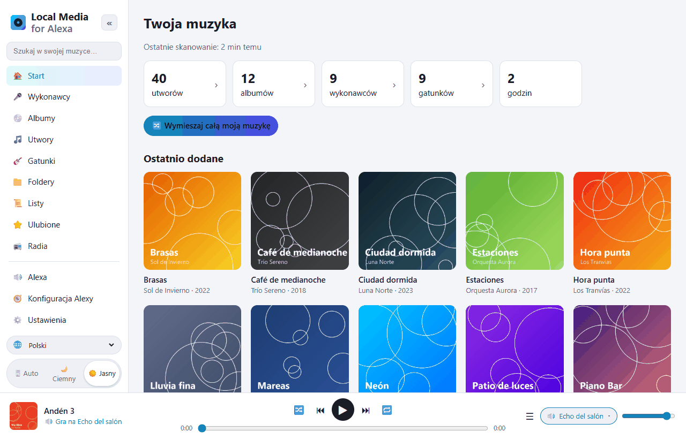
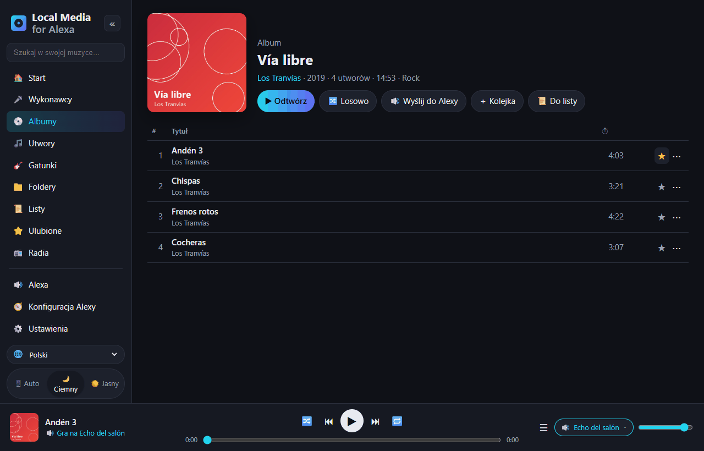
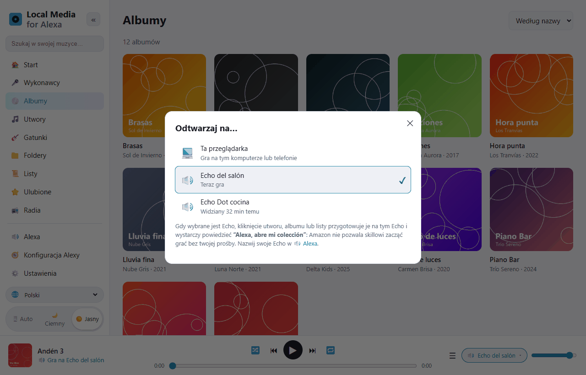
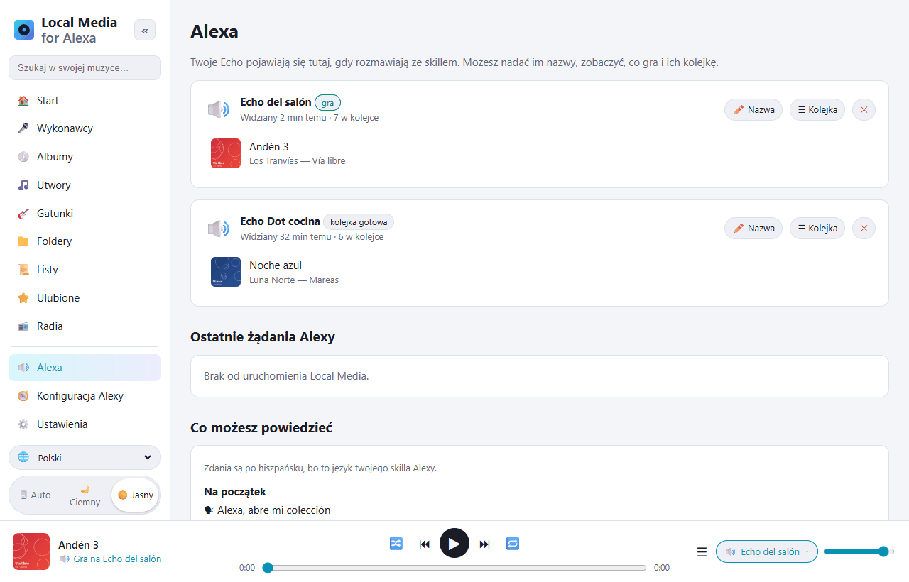
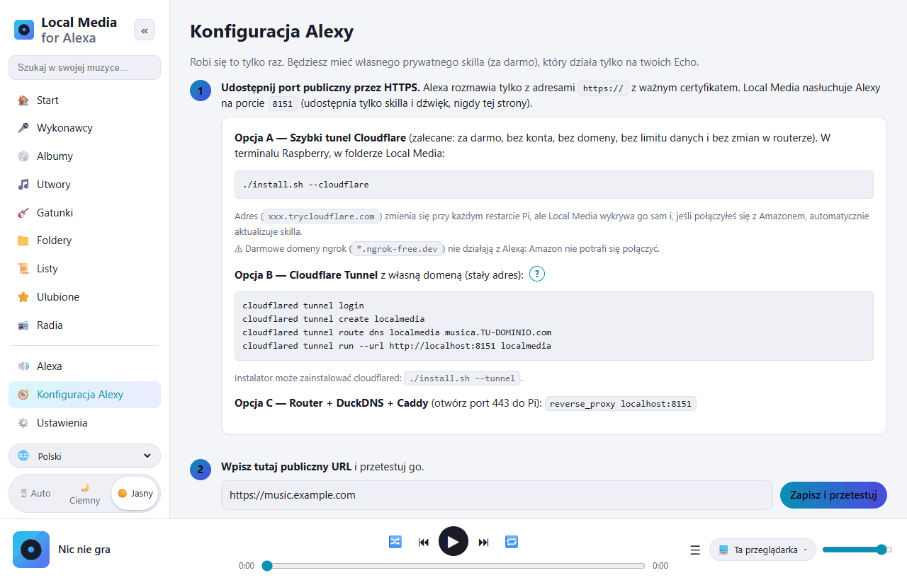

# Local Media for Alexa — muzyka z Raspberry Pi na Alexie

[Español](README.md) · [English](README.en.md) · [Português](README.pt.md) · [Français](README.fr.md) · [Deutsch](README.de.md) · [Italiano](README.it.md) · **Polski** · [Русский](README.ru.md) · [한국어](README.ko.md) · [日本語](README.ja.md)

Wolna, samodzielnie hostowana alternatywa dla *My Media for Alexa* na **Raspberry Pi / Linux ARM**
(działa też na każdym Linuksie x86 lub w Dockerze).
Skanuje Twoją muzykę (dysk USB, karta SD, zamontowany NAS lub serwery DLNA) i odtwarza ją
na urządzeniach Echo za pomocą głosu. Wszystko zostaje w domu: bez serwerów pośredniczących i kont firm trzecich.



Skill Alexy działa po **hiszpańsku** (Hiszpania, Meksyk, USA) i po **angielsku** (USA, Wielka Brytania);
Alexa nie oferuje własnych skilli po polsku. Polecenia wypowiada się w języku skilla:

```
"Alexa, abre mi colección"
"Alexa, pide a mi colección que ponga Queen"
"Alexa, pide a mi colección que ponga el disco Abbey Road"
"Alexa, abre mi colección reproduzca la pista Bohemian Rhapsody"
"Alexa, siguiente" · "Alexa, aleatorio" · "Alexa, pide a mi colección qué está sonando"
```

Po angielsku: *„Alexa, open my collection”*, *„Alexa, ask my collection to play Queen”*…

## Rzut oka na aplikację webową

Panel zarządzania otwierasz z telefonu lub komputera w domu (`http://IP-RASPBERRY:8080`).
Jest przetłumaczony na 10 języków (wybór 🌐 w lewym dolnym rogu) i ma motyw jasny oraz ciemny.

| | |
|---|---|
|  |  |
| **Przeglądaj bibliotekę** według wykonawców, albumów, utworów, gatunków, folderów, list i radia. Każdy utwór ma ulubione ⭐ i menu ⋯ (odtwórz jako następny, do kolejki, do listy…). | **Odtwarzaj na…**: gra w przeglądarce albo kolejka czeka na wybranym Echo. Wtedy wystarczy powiedzieć *„Alexa, abre mi colección”*. |
|  |  |
| **Alexa**: Twoje urządzenia Echo, co gra na każdym i jego kolejka. Nadaj im nazwy. Niżej wszystkie polecenia, które możesz wypowiedzieć. | **Konfiguracja Alexy**: przewodnik krok po kroku. Przycisk *Połącz z Amazonem* sam tworzy skill. |

## Instalacja na Raspberry Pi

Wymagania: Raspberry Pi 3/4/5 lub Zero 2 W z Raspberry Pi OS (Bookworm lub nowszy).

```bash
sudo apt update && sudo apt install -y git
git clone https://github.com/DivolandiaLabs/Local-Media-for-Alexa.git
cd Local-Media-for-Alexa
chmod +x install.sh
./install.sh --cloudflare
```

Opcje instalatora:

```bash
./install.sh --music /media/pi/USB/Muzyka   # od razu dodaje folder z muzyką
./install.sh --cloudflare                   # szybki tunel Cloudflare: darmowe HTTPS dla Alexy (zalecane)
./install.sh --tunnel                       # instaluje tylko cloudflared (tunel z własną domeną)
```

Otwórz `http://IP-RASPBERRY:8080` na telefonie lub komputerze:

1. **Ustawienia** → dodaj foldery → **Skanuj teraz**.
2. **Konfiguracja Alexy** → przewodnik krok po kroku (około 10 minut, tylko raz).

Aktualizacja do najnowszej wersji:

```bash
cd ~/Local-Media-for-Alexa && git pull && ./install.sh
```

Następnie w **Konfiguracja Alexy** naciśnij **🗣 Zaktualizuj model głosowy**, aby skill dostał nowe polecenia.

Z Dockerem: zobacz instrukcje na początku pliku [Dockerfile](Dockerfile).

### Starszy Raspberry Pi OS (Bullseye / Buster)

Sprawdź wersję poleceniem `cat /etc/os-release`. Raspberry Pi OS **Bullseye** (Debian 11) i
**Buster** (Debian 10) nie są już wspierane, a Debian usuwa ich pakiety ze
zwykłych serwerów: `apt` zwraca błędy `404 Not Found`. Local Media na nich działa
(wymaga tylko Pythona 3.7+), ale `apt` musi móc zainstalować `python3-venv` i `ffmpeg`.

**Zalecane:** nagrać nową kartę z aktualnym Raspberry Pi OS (64 bity)
za pomocą [Raspberry Pi Imager](https://www.raspberrypi.com/software/). Tylko on
nadal dostaje poprawki bezpieczeństwa.

**Szybkie rozwiązanie (zostać na Bullseye):** jeśli `sudo apt update` narzeka na
repozytoria Debiana, skieruj je do archiwum i spróbuj ponownie:

```bash
sudo cp /etc/apt/sources.list /etc/apt/sources.list.bak
echo "deb http://archive.debian.org/debian bullseye main contrib non-free" | sudo tee /etc/apt/sources.list
echo "deb http://archive.debian.org/debian-security bullseye-security main contrib non-free" | sudo tee -a /etc/apt/sources.list
sudo apt update
cd ~/Local-Media-for-Alexa && ./install.sh
```

(Aby cofnąć: `sudo cp /etc/apt/sources.list.bak /etc/apt/sources.list`.)

## Funkcje

| My Media for Alexa | Local Media |
|---|---|
| Odtwarzanie według wykonawcy, albumu, utworu, gatunku, listy | ✅ z wyszukiwaniem przybliżonym (radzi sobie z tym, co Alexa źle usłyszy) |
| Odtwarzanie według folderu | ✅ |
| Według roku / dekady | ✅ „muzyka z 1995”, „z lat dziewięćdziesiątych” |
| Cała biblioteka losowo | ✅ |
| Ostatnio dodane / najczęściej słuchane / ulubione | ✅ |
| „Więcej tego wykonawcy”, „włącz ten album” | ✅ |
| Dalej, wstecz, pauza, wznów, od początku | ✅ |
| Losowo i powtarzanie | ✅ |
| Przyciski Echo i sterowanie w aplikacji Alexa | ✅ |
| „Co teraz gra?” | ✅ |
| Okładka i tytuł na Echo Show / Spot / w aplikacji | ✅ (cover.jpg z folderu lub osadzona okładka) |
| Listy M3U / M3U8 / PLS | ✅ importowane automatycznie przy skanowaniu |
| Playlisty iTunes | ✅ czyta wyeksportowany `iTunes Library.xml` / `Library.xml` (Plik › Biblioteka › Eksportuj) |
| Losowe odtwarzanie albumu, wykonawcy, playlisty lub gatunku | ✅ |
| Tryby własnymi słowami („włącz tryb pętli”, „wyłącz shuffle”…) | ✅ |
| „Dodaj ten utwór do mojej playlisty X” | ✅ (tworzy ją w razie potrzeby) |
| „Nie puszczaj tego więcej” / „zapomnij ten utwór” | ✅ lista ignorowanych, do przywrócenia w Ustawieniach |
| Radio / strumienie internetowe („włącz stację X”) | ✅ sekcja 📻 Radia w aplikacji i pliki .m3u/.pls z adresami http |
| Audiobooki („czytaj X”) | ✅ pamięta, gdzie skończyłeś |
| Forma polecenia z My Media: „Alexa, abre mi colección reproduzca …” | ✅ |
| Własne listy | ✅ tworzone i edytowane w aplikacji, eksport do M3U |
| FLAC, WMA, OGG, OPUS, WAV, ALAC, APE… | ✅ konwersja w locie do MP3 przez ffmpeg (z przewijaniem/wznawianiem) |
| Serwery UPnP / DLNA (NAS, Plex, Jellyfin, MiniDLNA…) | ✅ |
| Kilka urządzeń Echo, każde z własną kolejką | ✅ |
| Grupy multiroom Alexy | ✅ (zarządza nimi Alexa) |
| Aplikacja webowa do przeglądania biblioteki | ✅ + odtwarzacz w przeglądarce, tryb ciemny, 10 języków |
| Przygotowanie kolejki w aplikacji i wysłanie jej do Echo | ✅ wybór „Odtwarzaj na…” |
| Automatyczne ponowne skanowanie | ✅ przyrostowe, co N minut |
| Dostęp zdalny | ✅ Cloudflare Tunnel / Caddy (bez serwerów pośredniczących firm trzecich) |
| Języki skilla (głos) | ✅ es-ES, es-MX, es-US, en-US, en-GB |

## Jak to wszystko się łączy

```
Echo ──głos──▶ Amazon ──HTTPS──▶ tunel (Cloudflare) ──▶ Pi :8765  /alexa   (skill)
Echo ◀──────────────── audio HTTPS ─────────────────── Pi :8765  /s/<sekret>/…
Ty (telefon/PC, w domu) ─────────────────────────────▶ Pi :8080  panel zarządzania
```

* **Port 8765** jest jedynym wystawionym do Internetu: odpowiada tylko Alexie (ze sprawdzonym
  podpisem Amazona) i serwuje audio oraz okładki za losowym tajnym kluczem.
* **Port 8080** (aplikacja webowa) zostaje w sieci domowej. Możesz ustawić hasło.
* Alexa wymaga HTTPS z ważnym certyfikatem, dlatego potrzebny jest tunel lub proxy.
  Najprościej użyć szybkiego tunelu Cloudflare (`./install.sh --cloudflare`):
  za darmo, bez konta i bez domeny. Jego adres zmienia się po restarcie, ale Local Media
  sam go wykrywa i aktualizuje skill.

## Skill Alexy

To **prywatny skill w trybie deweloperskim**: nigdy nie jest publikowany, jest darmowy i działa na wszystkich
urządzeniach Echo na Twoim koncie. Local Media generuje model głosowy **z nazwami z Twojej biblioteki**,
żeby Alexa lepiej je rozpoznawała. W [skill/](skill) jest też ogólny model i
manifest `skill.json` (dla `ask-cli`).

### Połącz z Amazonem (automatycznie)

W **Konfiguracja Alexy** jest przycisk **POŁĄCZ Z AMAZONEM**: logujesz się na swoje konto
Amazon, a Local Media sam tworzy skill (model głosowy z Twoją biblioteką, odtwarzacz
audio, adres i włączenie na Twoich Echo). Potem ponownie wysyła model głosowy
za każdym razem, gdy skanowanie zmieni bibliotekę.

Wcześniej, tylko raz, Amazon wymaga utworzenia **profilu bezpieczeństwa Login with Amazon**
(aplikacja podpowiada, co wkleić w każde pole):

1. [Login with Amazon](https://developer.amazon.com/loginwithamazon/console/site/lwa/overview.html)
   → *Create a New Security Profile* → nazwa, opis i jako *Consent Privacy Notice URL*
   `https://TWOJ-PUBLICZNY-URL/privacidad`.
2. *Web Settings* → *Allowed Return URLs*: `https://TWOJ-PUBLICZNY-URL/amazon/callback`.
3. Skopiuj *Client ID* i *Client Secret* do Local Media.

Sekret i uprawnienia Amazona są przechowywane tylko na Twoim Pi (`~/.localmedia/config.json`,
uprawnienia 600) i nigdy nie są pokazywane w aplikacji. *Rozłącz* je usuwa; skill nadal
działa.

Nazwa wywołania: **„mi colección”** (po angielsku *„my collection”*). Można ją zmienić
w konsoli Alexy (*Invocation*); Local Media od niej nie zależy.

Skille Alexy nie mogą zacząć grać same z siebie: gdy przygotujesz kolejkę
na Echo w aplikacji, powiedz *„Alexa, abre mi colección”*, żeby ruszyła.

## Języki

* **Aplikacja webowa:** hiszpański, angielski, portugalski, francuski, niemiecki, włoski, polski, rosyjski, koreański i japoński.
  Wybierasz w menu 🌐 (domyślnie język przeglądarki).
* **Głos (skill Alexy):** hiszpański (Hiszpania, Meksyk, USA) i angielski (USA, Wielka Brytania).

## Częste problemy

| Objaw | Rozwiązanie |
|---|---|
| „Wystąpił problem z odpowiedzią żądanego skilla” | Sprawdź `journalctl -u localmedia -f`. Jeśli żądanie jest zbyt stare, zegar Pi jest źle ustawiony (`timedatectl`). |
| Alexa odpowiada, ale nic nie gra | Publiczny URL nie jest dostępny przez HTTPS lub nie ma ważnego certyfikatu. Użyj przycisku *Zapisz i przetestuj* w przewodniku. |
| Używam ngrok i Alexa się nie łączy | Darmowe domeny ngrok nie działają z Alexą. Użyj `./install.sh --cloudflare`. |
| Pliki FLAC nie grają | Brakuje ffmpeg: `sudo apt install ffmpeg`. |
| Alexa nie rozumie nietypowej nazwy | Naciśnij **🗣 Zaktualizuj model głosowy** w *Konfiguracja Alexy* (zawiera Twoją bibliotekę). |
| Nie widać utworów z NAS | Zamontuj udział (`/etc/fstab`, CIFS/NFS) i dodaj go albo włącz UPnP/DLNA w Ustawieniach. |

Przydatne polecenia:

```bash
journalctl -u localmedia -f          # zobaczyć, co się dzieje
sudo systemctl restart localmedia    # uruchomić ponownie
./uninstall.sh                       # usunąć usługę (Twoja muzyka nie zostanie usunięta)
```

## Pliki

```
localmedia/          program (Python 3.9+)
  alexa.py           intencje, kolejki na urządzenie, zdarzenia AudioPlayer
  alexa_verify.py    weryfikacja podpisu i certyfikatu Amazona
  amazon.py          Login with Amazon i automatyczne tworzenie skilla
  tunnel.py          śledzi adres szybkiego tunelu Cloudflare
  library.py         skanowanie, tagi (mutagen), okładki, listy, wyszukiwanie
  media.py           wysyłanie audio z przewijaniem i konwersją ffmpeg
  upnp.py            klient UPnP/DLNA
  skillmodel.py      generuje model głosowy skilla
  web.py             serwer publiczny (Alexa) i panel zarządzania
  static/            aplikacja webowa (static/i18n/ = tłumaczenia)
skill/               ogólny model głosowy i manifest skilla
docs/screenshots/    zrzuty ekranu do tego README
install.sh           instalator dla Raspberry Pi OS / Debian
```

Dane (ustawienia, baza danych, pamięć podręczna okładek): `~/.localmedia/`.
