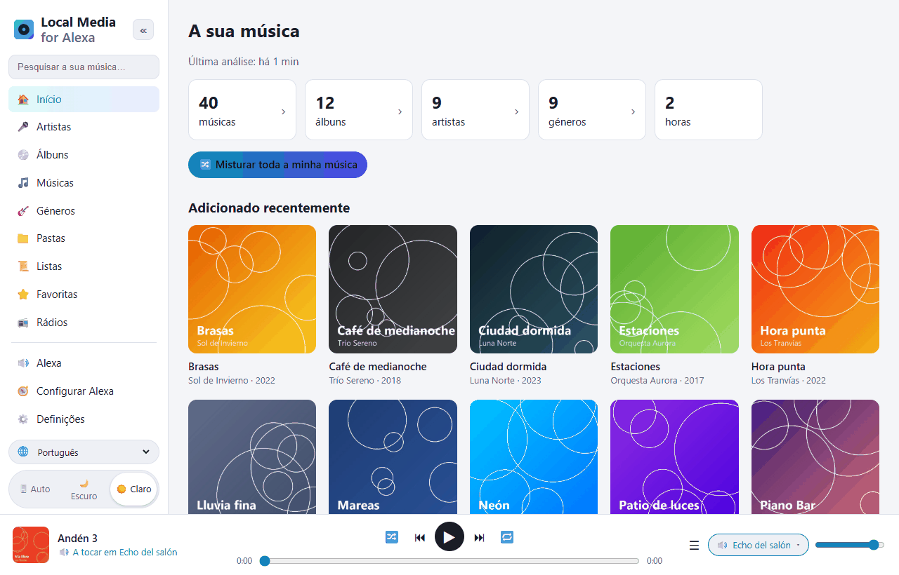
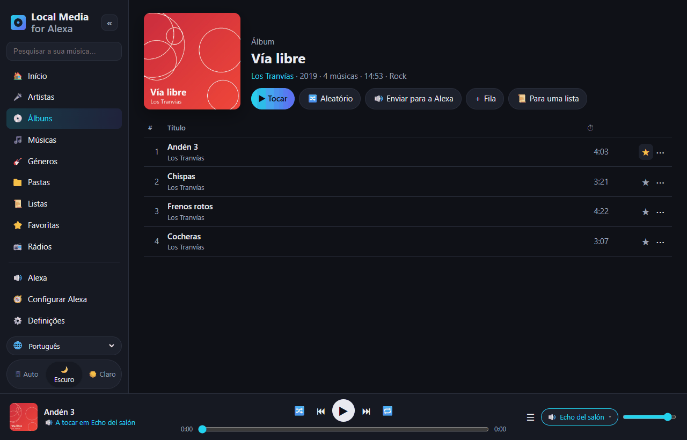
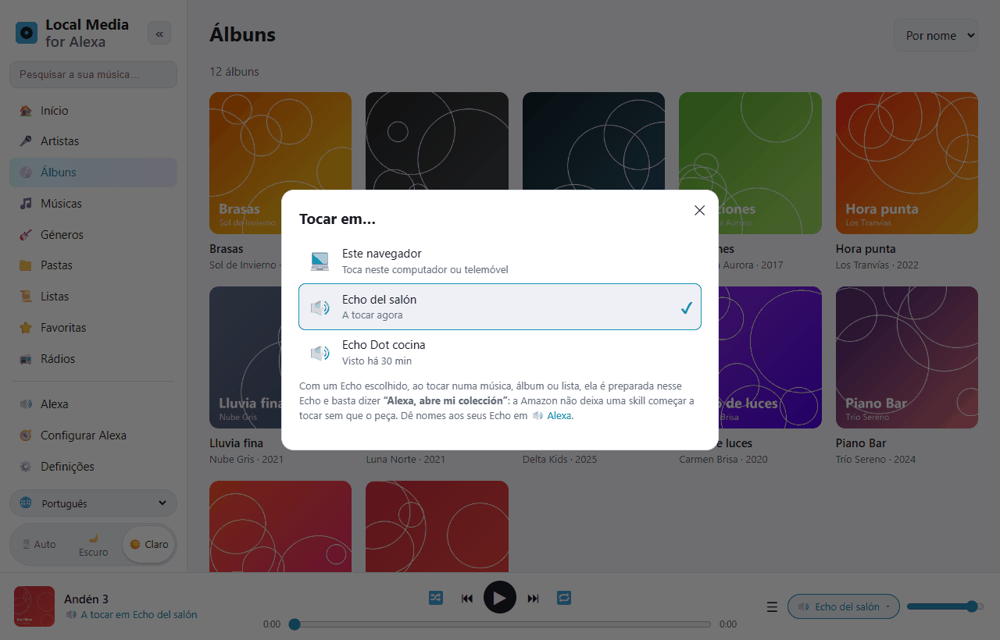
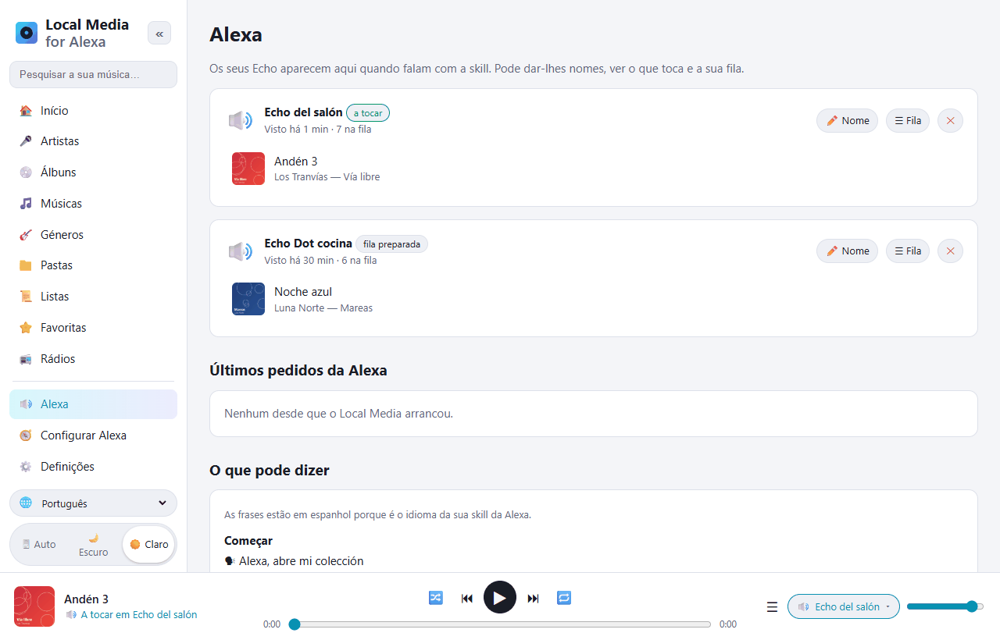
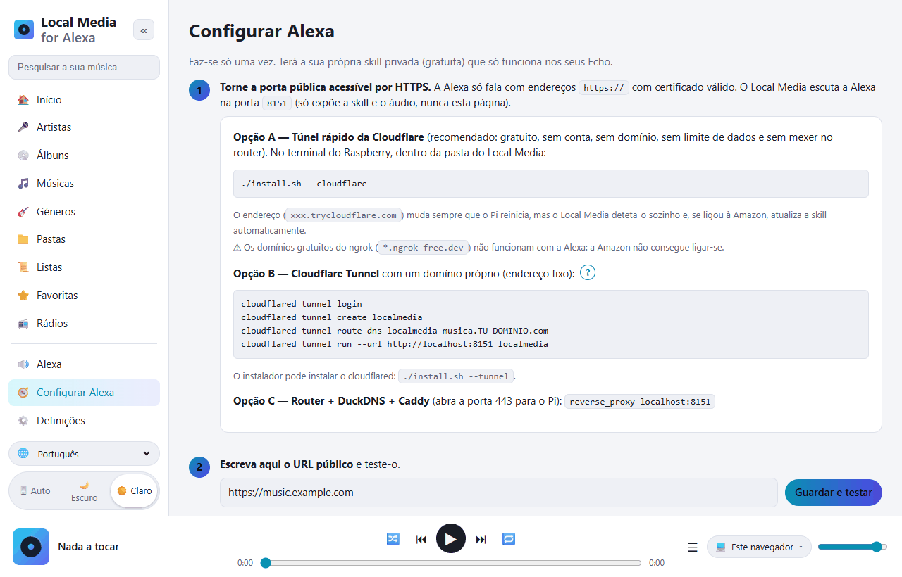

# Local Media for Alexa — a música do teu Raspberry Pi na Alexa

[Español](README.md) · [English](README.en.md) · **Português** · [Français](README.fr.md) · [Deutsch](README.de.md) · [Italiano](README.it.md) · [Polski](README.pl.md) · [Русский](README.ru.md) · [한국어](README.ko.md) · [日本語](README.ja.md)

Alternativa livre e auto-alojada ao *My Media for Alexa* para **Raspberry Pi / Linux ARM**
(funciona também em qualquer Linux x86 ou com Docker).
Analisa a tua música (disco USB, cartão SD, NAS montado ou servidores DLNA) e toca-a
nos teus Echo por voz. Tudo fica em casa: sem servidores intermédios nem contas de terceiros.



A skill da Alexa funciona em **espanhol** (Espanha, México, EUA) e **inglês** (EUA, Reino Unido).
As frases são ditas no idioma da skill:

```
"Alexa, abre mi colección"
"Alexa, pide a mi colección que ponga Queen"
"Alexa, pide a mi colección que ponga el disco Abbey Road"
"Alexa, abre mi colección reproduzca la pista Bohemian Rhapsody"
"Alexa, siguiente" · "Alexa, aleatorio" · "Alexa, pide a mi colección qué está sonando"
```

Em inglês: *“Alexa, open my collection”*, *“Alexa, ask my collection to play Queen”*…

## Um olhar sobre a web

A web de gestão abre-se no telemóvel ou no computador de casa (`http://IP-DO-PI:8080`).
Está traduzida para 10 idiomas (seletor 🌐 em baixo à esquerda) e tem modo claro e escuro.

| | |
|---|---|
|  |  |
| **Explora a tua biblioteca** por artistas, álbuns, faixas, géneros, pastas, listas e rádios. Cada faixa tem favorito ⭐ e menu ⋯ (a seguir, para a fila, para uma lista…). | **Tocar em…**: toca no navegador ou fica preparado no Echo que escolheres. Depois basta dizer *“Alexa, abre mi colección”*. |
|  |  |
| **Alexa**: os teus Echo, o que toca em cada um e a sua fila. Dá-lhes nome. Mais abaixo, todas as frases que podes dizer. | **Configurar Alexa**: guia passo a passo. Com o botão *Ligar à Amazon* a skill cria-se sozinha. |

## Instalação no Raspberry Pi

Requisitos: Raspberry Pi 3/4/5 ou Zero 2 W com Raspberry Pi OS (Bookworm ou posterior).

```bash
sudo apt update && sudo apt install -y git
git clone https://github.com/DivolandiaLabs/Local-Media-for-Alexa.git
cd Local-Media-for-Alexa
chmod +x install.sh
./install.sh --cloudflare
```

Opções do instalador:

```bash
./install.sh --music /media/pi/USB/Musica   # adiciona já uma pasta de música
./install.sh --cloudflare                   # túnel rápido da Cloudflare: HTTPS grátis para a Alexa (recomendado)
./install.sh --tunnel                       # só instala o cloudflared (túnel com domínio próprio)
```

Abre `http://IP-DO-PI:8080` no telemóvel ou no computador:

1. **Definições** → adiciona pastas → **Analisar agora**.
2. **Configurar Alexa** → guia passo a passo (uns 10 minutos, só uma vez).

Atualizar para a última versão:

```bash
cd ~/Local-Media-for-Alexa && git pull && ./install.sh
```

Depois, em **Configurar Alexa**, carrega em **🗣 Atualizar modelo de voz** para a skill receber as frases novas.

Com Docker: vê as instruções no início do [Dockerfile](Dockerfile).

### Raspberry Pi OS antigo (Bullseye / Buster)

Vê a tua versão com `cat /etc/os-release`. O Raspberry Pi OS **Bullseye** (Debian 11) e o
**Buster** (Debian 10) já não têm suporte, e o Debian está a retirar os seus pacotes dos
servidores normais: o `apt` dá erros `404 Not Found`. O Local Media funciona neles
(só precisa de Python 3.7+), mas o `apt` tem de conseguir instalar `python3-venv` e `ffmpeg`.

**Opção recomendada:** gravar um cartão novo com o Raspberry Pi OS atual (64 bits)
usando o [Raspberry Pi Imager](https://www.raspberrypi.com/software/). É o único que
continua a receber atualizações de segurança.

**Opção rápida (continuar no Bullseye):** se o `sudo apt update` se queixar dos
repositórios do Debian, aponta-os para o arquivo histórico e tenta de novo:

```bash
sudo cp /etc/apt/sources.list /etc/apt/sources.list.bak
echo "deb http://archive.debian.org/debian bullseye main contrib non-free" | sudo tee /etc/apt/sources.list
echo "deb http://archive.debian.org/debian-security bullseye-security main contrib non-free" | sudo tee -a /etc/apt/sources.list
sudo apt update
cd ~/Local-Media-for-Alexa && ./install.sh
```

(Para voltar atrás: `sudo cp /etc/apt/sources.list.bak /etc/apt/sources.list`.)

## Funcionalidades

| My Media for Alexa | Local Media |
|---|---|
| Tocar por artista, álbum, faixa, género, lista | ✅ com pesquisa aproximada (tolera o que a Alexa ouve mal) |
| Tocar por pasta | ✅ |
| Por ano / década | ✅ "música de 1995", "dos anos noventa" |
| Toda a biblioteca em aleatório | ✅ |
| Adicionadas recentemente / mais ouvidas / favoritas | ✅ |
| "Mais deste artista", "põe este álbum" | ✅ |
| Seguinte, anterior, pausa, continuar, recomeçar | ✅ |
| Aleatório e repetição | ✅ |
| Botões do Echo e da app Alexa | ✅ |
| "O que está a tocar?" | ✅ |
| Capa e título no Echo Show / Spot / app | ✅ (cover.jpg da pasta ou capa incorporada) |
| Listas M3U / M3U8 / PLS | ✅ importadas automaticamente ao analisar |
| Playlists do iTunes | ✅ lê o `iTunes Library.xml` / `Library.xml` exportado (Ficheiro › Biblioteca › Exportar) |
| Aleatório de um álbum, artista, playlist ou género | ✅ |
| Modos com palavras próprias ("ativa o modo loop", "desativa o shuffle"…) | ✅ |
| "Adiciona esta à minha playlist X" | ✅ (cria-a se não existir) |
| "Não ponhas esta outra vez" / "esquece esta faixa" | ✅ lista de ignoradas, recuperável nas Definições |
| Rádios / streams da Internet ("põe a estação X") | ✅ secção 📻 Rádios na web e .m3u/.pls com endereços http |
| Audiolivros ("lê X") | ✅ lembra-se de onde ficaste |
| Forma de frase do My Media: "Alexa, abre mi colección reproduzca …" | ✅ |
| Listas próprias | ✅ criadas e editadas na web, exportáveis para M3U |
| FLAC, WMA, OGG, OPUS, WAV, ALAC, APE… | ✅ conversão em tempo real para MP3 com ffmpeg (com saltos/retoma) |
| Servidores UPnP / DLNA (NAS, Plex, Jellyfin, MiniDLNA…) | ✅ |
| Vários Echo, cada um com a sua fila | ✅ |
| Grupos multissala da Alexa | ✅ (geridos pela Alexa) |
| Web para explorar a biblioteca | ✅ + leitor no navegador, modo escuro, 10 idiomas |
| Preparar uma fila na web e enviá-la para um Echo | ✅ seletor "Tocar em…" |
| Nova análise automática | ✅ incremental, a cada N minutos |
| Acesso remoto | ✅ Cloudflare Tunnel / Caddy (sem servidores intermédios de terceiros) |
| Idiomas da skill (voz) | ✅ es-ES, es-MX, es-US, en-US, en-GB |

## Como tudo se encaixa

```
Echo ──voz──▶ Amazon ──HTTPS──▶ túnel (Cloudflare) ──▶ Pi :8765  /alexa   (skill)
Echo ◀──────────────── áudio HTTPS ─────────────────── Pi :8765  /s/<segredo>/…
Tu (telemóvel/PC, em casa) ──────────────────────────▶ Pi :8080  web de gestão
```

* A **porta 8765** é a única exposta à Internet: só atende a Alexa (com a assinatura da
  Amazon verificada) e serve áudio e capas atrás de uma chave secreta aleatória.
* A **porta 8080** (a web) fica na tua rede local. Podes pôr-lhe palavra-passe.
* A Alexa exige HTTPS com um certificado válido, por isso é preciso um túnel ou um proxy.
  A opção mais simples é o túnel rápido da Cloudflare (`./install.sh --cloudflare`):
  grátis, sem conta nem domínio. O endereço muda ao reiniciar, mas o Local Media
  deteta-o e atualiza a skill sozinho.
* Se o túnel rápido ficar pendurado (a Cloudflare apaga o endereço mas o programa continua a correr), o Local Media nota: verifica o endereço a cada 5 minutos e, após 3 falhas seguidas, reinicia o túnel e envia o novo endereço à Amazon. Não gasta recursos apreciáveis.

## A skill da Alexa

É uma skill **privada em modo de desenvolvimento**: não é publicada, é grátis e funciona em todos
os Echo da tua conta. O Local Media gera o modelo de voz **com os nomes da tua biblioteca**
para que a Alexa os reconheça melhor. Em [skill/](skill) há também um modelo genérico e
o manifesto `skill.json` (para o `ask-cli`).

### Ligar à Amazon (automático)

Em **Configurar Alexa** está o botão **LIGAR À AMAZON**: inicias sessão com a tua conta
Amazon e o Local Media cria a skill sozinho (modelo de voz com a tua biblioteca, leitor de
áudio, endereço e ativação nos teus Echo). Depois volta a enviar o modelo de voz
sempre que uma análise muda a biblioteca.

Antes, uma única vez, a Amazon pede para criar um **perfil de segurança do Login with Amazon**
(a web diz-te o que colar em cada campo):

1. [Login with Amazon](https://developer.amazon.com/loginwithamazon/console/site/lwa/overview.html)
   → *Create a New Security Profile* → nome, descrição e, como *Consent Privacy Notice URL*,
   `https://O-TEU-URL-PUBLICO/privacidad`.
2. *Web Settings* → *Allowed Return URLs*: `https://O-TEU-URL-PUBLICO/amazon/callback`.
3. Copia o *Client ID* e o *Client Secret* para o Local Media.

O segredo e as autorizações da Amazon ficam guardados só no teu Pi (`~/.localmedia/config.json`,
permissões 600) e nunca aparecem na web. *Desligar* apaga-os; a skill continua
a funcionar.

Nome de invocação: **"mi colección"** (em inglês *"my collection"*). Pode ser alterado
na consola da Alexa (*Invocation*); o Local Media não depende dele.

As skills da Alexa não podem começar a tocar por iniciativa própria: quando preparas uma fila
num Echo a partir da web, diz *"Alexa, abre mi colección"* para começar.

## Idiomas

* **Web:** espanhol, inglês, português, francês, alemão, italiano, polaco, russo, coreano e japonês.
  Escolhe-se com o seletor 🌐 (por omissão, o idioma do navegador).
* **Voz (skill da Alexa):** espanhol (Espanha, México, EUA) e inglês (EUA, Reino Unido).

## Problemas frequentes

| Sintoma | Solução |
|---|---|
| "Houve um problema com a resposta da skill pedida" | Vê `journalctl -u localmedia -f`. Se disser que o pedido é demasiado antigo, a hora do Pi está errada (`timedatectl`). |
| A Alexa responde mas não toca | O URL público não está acessível por HTTPS ou não tem certificado válido. Usa o botão *Guardar e testar* do guia. |
| Uso o ngrok e a Alexa não liga | Os domínios gratuitos do ngrok não funcionam com a Alexa. Usa `./install.sh --cloudflare`. |
| Os FLAC não tocam | Falta o ffmpeg: `sudo apt install ffmpeg`. |
| A Alexa não percebe um nome estranho | Carrega em **🗣 Atualizar modelo de voz** em *Configurar Alexa* (inclui a tua biblioteca). |
| As faixas de um NAS não aparecem | Monta a pasta partilhada (`/etc/fstab`, CIFS/NFS) e adiciona-a, ou ativa o UPnP/DLNA nas Definições. |

Comandos úteis:

```bash
journalctl -u localmedia -f          # ver o que se passa
sudo systemctl restart localmedia    # reiniciar
./uninstall.sh                       # remover o serviço (não apaga a tua música)
```

## Ficheiros

```
localmedia/          o programa (Python 3.9+)
  alexa.py           intents, filas por dispositivo, eventos do AudioPlayer
  alexa_verify.py    verificação da assinatura e do certificado da Amazon
  amazon.py          Login with Amazon e criação automática da skill
  tunnel.py          acompanha o endereço do túnel rápido da Cloudflare
  library.py         análise, etiquetas (mutagen), capas, listas, pesquisa
  media.py           envio de áudio com saltos e conversão com ffmpeg
  upnp.py            cliente UPnP/DLNA
  skillmodel.py      gera o modelo de voz da skill
  web.py             servidor público (Alexa) e web de gestão
  static/            a web (static/i18n/ = traduções)
skill/               modelo de voz genérico e manifesto da skill
docs/screenshots/    capturas deste README
install.sh           instalador para Raspberry Pi OS / Debian
```

Dados (configuração, base de dados, cache de capas): `~/.localmedia/`.
