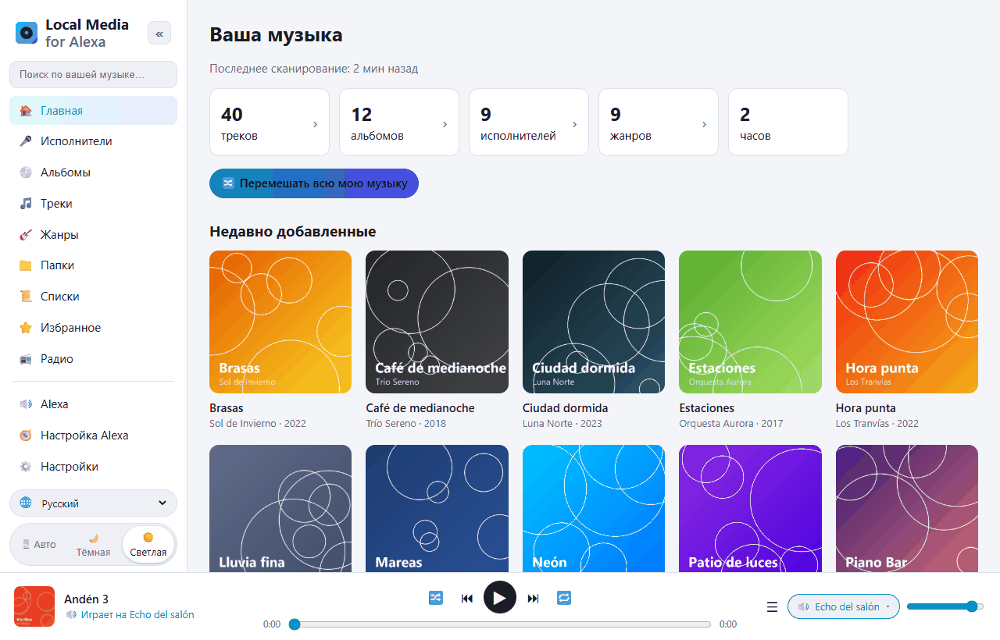
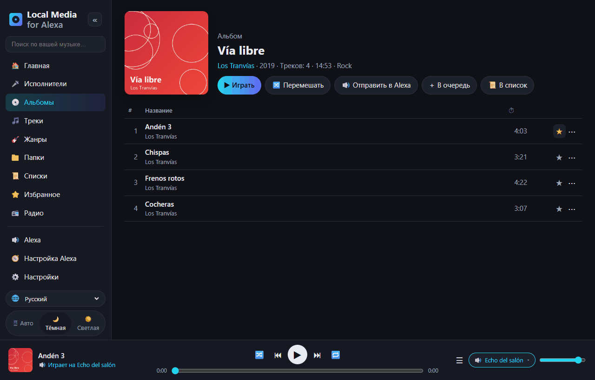
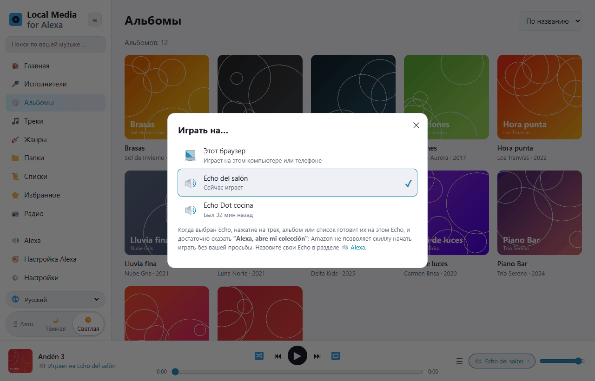
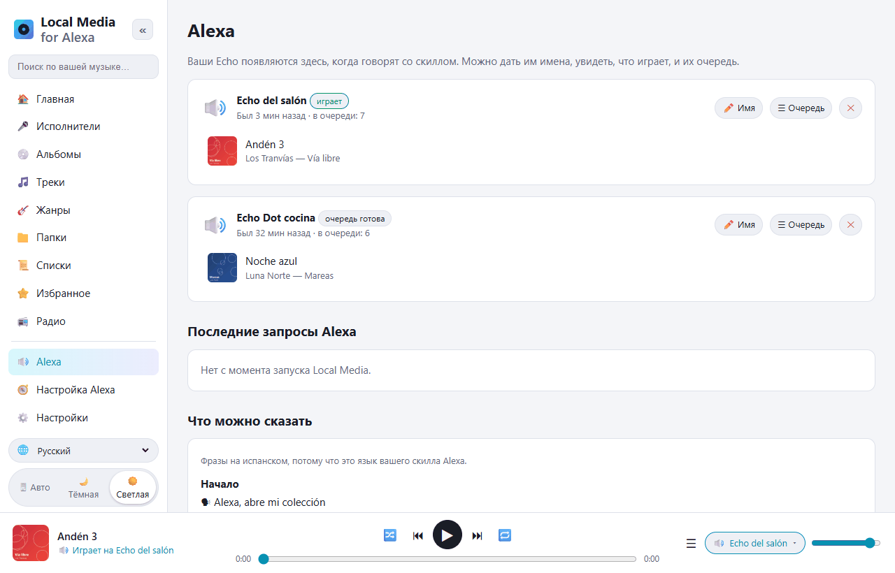
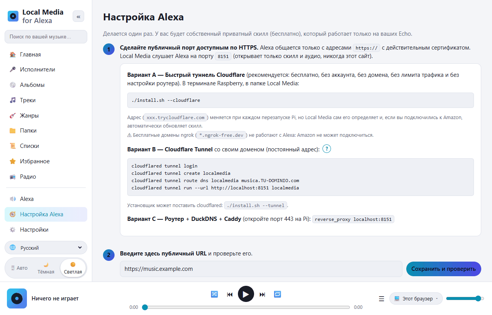

# Local Media for Alexa — музыка с Raspberry Pi на Alexa

[Español](README.md) · [English](README.en.md) · [Português](README.pt.md) · [Français](README.fr.md) · [Deutsch](README.de.md) · [Italiano](README.it.md) · [Polski](README.pl.md) · **Русский** · [한국어](README.ko.md) · [日本語](README.ja.md)

Свободная альтернатива *My Media for Alexa* на собственном сервере для **Raspberry Pi / Linux ARM**
(работает и на любом Linux x86, и в Docker).
Сканирует вашу музыку (USB-диск, SD-карта, подключённый NAS или DLNA-серверы) и воспроизводит её
на колонках Echo голосом. Всё остаётся дома: никаких промежуточных серверов и сторонних аккаунтов.



Навык Alexa работает на **испанском** (Испания, Мексика, США) и **английском** (США, Великобритания);
навыков на русском Alexa не поддерживает. Фразы произносятся на языке навыка:

```
"Alexa, abre mi colección"
"Alexa, pide a mi colección que ponga Queen"
"Alexa, pide a mi colección que ponga el disco Abbey Road"
"Alexa, abre mi colección reproduzca la pista Bohemian Rhapsody"
"Alexa, siguiente" · "Alexa, aleatorio" · "Alexa, pide a mi colección qué está sonando"
```

По-английски: *«Alexa, open my collection»*, *«Alexa, ask my collection to play Queen»*…

## Знакомство с веб-интерфейсом

Панель управления открывается с телефона или компьютера дома (`http://IP-RASPBERRY:8080`).
Она переведена на 10 языков (переключатель 🌐 внизу слева) и имеет светлую и тёмную темы.

| | |
|---|---|
|  |  |
| **Просматривайте медиатеку** по исполнителям, альбомам, трекам, жанрам, папкам, спискам и радио. У каждого трека есть избранное ⭐ и меню ⋯ (играть следующим, в очередь, в список…). | **Играть на…**: звук в браузере или очередь, подготовленная на выбранном Echo. Затем достаточно сказать *«Alexa, abre mi colección»*. |
|  |  |
| **Alexa**: ваши Echo, что играет на каждой и её очередь. Дайте им имена. Ниже — все фразы, которые можно сказать. | **Настройка Alexa**: пошаговое руководство. Кнопка *Подключиться к Amazon* создаёт навык автоматически. |

## Установка на Raspberry Pi

Требования: Raspberry Pi 3/4/5 или Zero 2 W с Raspberry Pi OS (Bookworm или новее).

```bash
sudo apt update && sudo apt install -y git
git clone https://github.com/DivolandiaLabs/Local-Media-for-Alexa.git
cd Local-Media-for-Alexa
chmod +x install.sh
./install.sh --cloudflare
```

Параметры установщика:

```bash
./install.sh --music /media/pi/USB/Music    # сразу добавить папку с музыкой
./install.sh --cloudflare                   # быстрый туннель Cloudflare: бесплатный HTTPS для Alexa (рекомендуется)
./install.sh --tunnel                       # только установить cloudflared (туннель со своим доменом)
```

Откройте `http://IP-RASPBERRY:8080` с телефона или компьютера:

1. **Настройки** → добавьте папки → **Сканировать сейчас**.
2. **Настройка Alexa** → пошаговое руководство (около 10 минут, один раз).

Обновление до последней версии:

```bash
cd ~/Local-Media-for-Alexa && git pull && ./install.sh
```

Затем в разделе **Настройка Alexa** нажмите **🗣 Обновить голосовую модель**, чтобы навык получил новые фразы.

С Docker: см. инструкции в начале [Dockerfile](Dockerfile).

### Старые Raspberry Pi OS (Bullseye / Buster)

Узнайте версию командой `cat /etc/os-release`. Raspberry Pi OS **Bullseye** (Debian 11) и
**Buster** (Debian 10) больше не поддерживаются, и Debian убирает их пакеты с
обычных серверов: `apt` выдаёт ошибки `404 Not Found`. Local Media на них работает
(нужен лишь Python 3.7+), но `apt` должен суметь установить `python3-venv` и `ffmpeg`.

**Рекомендуется:** записать новую карту с актуальной Raspberry Pi OS (64 бита)
с помощью [Raspberry Pi Imager](https://www.raspberrypi.com/software/). Только она
продолжает получать обновления безопасности.

**Быстрый вариант (остаться на Bullseye):** если `sudo apt update` ругается на
репозитории Debian, направьте их на архив и повторите:

```bash
sudo cp /etc/apt/sources.list /etc/apt/sources.list.bak
echo "deb http://archive.debian.org/debian bullseye main contrib non-free" | sudo tee /etc/apt/sources.list
echo "deb http://archive.debian.org/debian-security bullseye-security main contrib non-free" | sudo tee -a /etc/apt/sources.list
sudo apt update
cd ~/Local-Media-for-Alexa && ./install.sh
```

(Чтобы вернуть как было: `sudo cp /etc/apt/sources.list.bak /etc/apt/sources.list`.)

## Возможности

| My Media for Alexa | Local Media |
|---|---|
| Воспроизведение по исполнителю, альбому, треку, жанру, списку | ✅ с нечётким поиском (справляется с тем, что Alexa расслышала неверно) |
| Воспроизведение по папке | ✅ |
| По году / десятилетию | ✅ «музыка 1995 года», «девяностых» |
| Вся медиатека вперемешку | ✅ |
| Недавно добавленные / самые прослушиваемые / избранное | ✅ |
| «Ещё этого исполнителя», «включи этот альбом» | ✅ |
| Дальше, назад, пауза, продолжить, сначала | ✅ |
| Перемешивание и повтор | ✅ |
| Кнопки Echo и управление в приложении Alexa | ✅ |
| «Что сейчас играет?» | ✅ |
| Обложка и название на Echo Show / Spot / в приложении | ✅ (cover.jpg из папки или встроенная обложка) |
| Списки M3U / M3U8 / PLS | ✅ импортируются автоматически при сканировании |
| Плейлисты iTunes | ✅ читает экспортированный `iTunes Library.xml` / `Library.xml` (Файл › Медиатека › Экспортировать) |
| Перемешать альбом, исполнителя, плейлист или жанр | ✅ |
| Режимы своими словами («включи режим повтора», «выключи shuffle»…) | ✅ |
| «Добавь это в мой плейлист X» | ✅ (создаёт его при необходимости) |
| «Больше не включай это» / «забудь этот трек» | ✅ список игнорируемых, восстанавливается в Настройках |
| Интернет-радио / потоки («включи станцию X») | ✅ раздел 📻 Радио в интерфейсе и файлы .m3u/.pls с http-адресами |
| Аудиокниги («читай X») | ✅ помнит, где вы остановились |
| Формулировка My Media: «Alexa, abre mi colección reproduzca …» | ✅ |
| Свои списки | ✅ создаются и редактируются в интерфейсе, экспорт в M3U |
| FLAC, WMA, OGG, OPUS, WAV, ALAC, APE… | ✅ конвертация в MP3 на лету через ffmpeg (с перемоткой/продолжением) |
| Серверы UPnP / DLNA (NAS, Plex, Jellyfin, MiniDLNA…) | ✅ |
| Несколько Echo, у каждой своя очередь | ✅ |
| Мультирум-группы Alexa | ✅ (ими управляет Alexa) |
| Веб-интерфейс для просмотра медиатеки | ✅ + плеер в браузере, тёмная тема, 10 языков |
| Подготовить очередь в интерфейсе и отправить на Echo | ✅ переключатель «Играть на…» |
| Автоматическое повторное сканирование | ✅ инкрементальное, каждые N минут |
| Удалённый доступ | ✅ Cloudflare Tunnel / Caddy (без сторонних промежуточных серверов) |
| Языки навыка (голос) | ✅ es-ES, es-MX, es-US, en-US, en-GB |

## Как всё устроено

```
Echo ──голос──▶ Amazon ──HTTPS──▶ туннель (Cloudflare) ──▶ Pi :8765  /alexa   (навык)
Echo ◀──────────────── аудио по HTTPS ─────────────────── Pi :8765  /s/<секрет>/…
Вы (телефон/ПК, дома) ───────────────────────────────────▶ Pi :8080  панель управления
```

* **Порт 8765** — единственный, открытый в Интернет: он отвечает только Alexa (с проверкой
  подписи Amazon) и отдаёт аудио и обложки по случайному секретному ключу.
* **Порт 8080** (веб-интерфейс) остаётся в вашей домашней сети. Можно задать пароль.
* Alexa требует HTTPS с действительным сертификатом, поэтому нужен туннель или прокси.
  Проще всего — быстрый туннель Cloudflare (`./install.sh --cloudflare`):
  бесплатно, без аккаунта и домена. Его адрес меняется при перезагрузке, но Local Media
  сам его находит и обновляет навык.

## Навык Alexa

Это **частный навык в режиме разработки**: он не публикуется, бесплатен и работает на всех
Echo вашего аккаунта. Local Media строит голосовую модель **с названиями из вашей медиатеки**,
чтобы Alexa лучше их распознавала. В [skill/](skill) также есть общая модель и
манифест `skill.json` (для `ask-cli`).

### Подключиться к Amazon (автоматически)

В разделе **Настройка Alexa** есть кнопка **ПОДКЛЮЧИТЬСЯ К AMAZON**: вы входите в свой аккаунт
Amazon, и Local Media сам создаёт навык (голосовая модель с вашей медиатекой, аудиоплеер,
адрес и включение на ваших Echo). После этого он заново загружает голосовую модель
каждый раз, когда сканирование меняет медиатеку.

Перед этим, один раз, Amazon требует создать **профиль безопасности Login with Amazon**
(интерфейс подскажет, что вставить в каждое поле):

1. [Login with Amazon](https://developer.amazon.com/loginwithamazon/console/site/lwa/overview.html)
   → *Create a New Security Profile* → имя, описание и в качестве *Consent Privacy Notice URL*
   `https://ВАШ-ПУБЛИЧНЫЙ-URL/privacidad`.
2. *Web Settings* → *Allowed Return URLs*: `https://ВАШ-ПУБЛИЧНЫЙ-URL/amazon/callback`.
3. Скопируйте *Client ID* и *Client Secret* в Local Media.

Секрет и разрешения Amazon хранятся только на вашем Pi (`~/.localmedia/config.json`,
права 600) и никогда не показываются в интерфейсе. *Отключить* удаляет их; навык продолжает
работать.

Имя вызова: **«mi colección»** (по-английски *«my collection»*). Его можно изменить
в консоли Alexa (*Invocation*); Local Media от него не зависит.

Навыки Alexa не могут начать играть сами: когда вы готовите очередь
на Echo из интерфейса, скажите *«Alexa, abre mi colección»*, чтобы она запустилась.

## Языки

* **Веб-интерфейс:** испанский, английский, португальский, французский, немецкий, итальянский, польский, русский, корейский и японский.
  Выбирается переключателем 🌐 (по умолчанию — язык браузера).
* **Голос (навык Alexa):** испанский (Испания, Мексика, США) и английский (США, Великобритания).

## Частые проблемы

| Симптом | Решение |
|---|---|
| «Возникла проблема с ответом запрошенного навыка» | Смотрите `journalctl -u localmedia -f`. Если запрос слишком старый, на Pi неверное время (`timedatectl`). |
| Alexa отвечает, но ничего не играет | Публичный URL недоступен по HTTPS или у него нет действительного сертификата. Нажмите *Сохранить и проверить* в руководстве. |
| Использую ngrok, и Alexa не подключается | Бесплатные домены ngrok не работают с Alexa. Используйте `./install.sh --cloudflare`. |
| FLAC не играют | Нет ffmpeg: `sudo apt install ffmpeg`. |
| Alexa не понимает необычное название | Нажмите **🗣 Обновить голосовую модель** в *Настройка Alexa* (она включает вашу медиатеку). |
| Не видны треки с NAS | Подключите общую папку (`/etc/fstab`, CIFS/NFS) и добавьте её или включите UPnP/DLNA в Настройках. |

Полезные команды:

```bash
journalctl -u localmedia -f          # посмотреть, что происходит
sudo systemctl restart localmedia    # перезапустить
./uninstall.sh                       # удалить службу (музыка не удаляется)
```

## Файлы

```
localmedia/          программа (Python 3.9+)
  alexa.py           интенты, очереди для каждого устройства, события AudioPlayer
  alexa_verify.py    проверка подписи и сертификата Amazon
  amazon.py          Login with Amazon и автоматическое создание навыка
  tunnel.py          отслеживает адрес быстрого туннеля Cloudflare
  library.py         сканирование, теги (mutagen), обложки, списки, поиск
  media.py           отдача аудио с перемоткой и конвертация ffmpeg
  upnp.py            клиент UPnP/DLNA
  skillmodel.py      строит голосовую модель навыка
  web.py             публичный сервер (Alexa) и панель управления
  static/            веб-интерфейс (static/i18n/ = переводы)
skill/               общая голосовая модель и манифест навыка
docs/screenshots/    снимки экрана для этого README
install.sh           установщик для Raspberry Pi OS / Debian
```

Данные (настройки, база данных, кэш обложек): `~/.localmedia/`.
